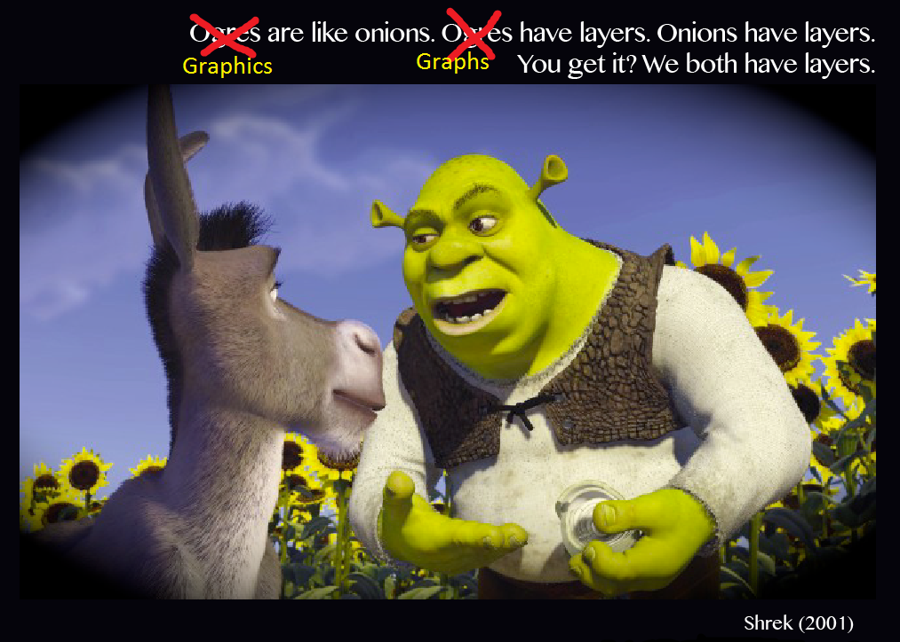

```{r setup, include = FALSE, echo = FALSE}
library(tidyverse)
library(lubridate)
library(gt)
library(paletteer)
library(ggridges)

#Working directory for .RMD
# knitr::opts_knit$set(echo = TRUE,
#                      root.dir = rprojroot::find_rstudio_root_file())

#Controlling figure output in markdown
knitr::opts_chunk$set(
#  fig.height =   
  fig.width = 6,
#  fig.asp = .5,
  out.width = "90%",
#  out.height = 
 fig.align  = "center",
  cache = TRUE,
  eval  = TRUE,
  echo  = TRUE
)

#My Colours (from viridis)
my_purple <- "#440154FF"
my_yellow <- "#FDE725FF"

#Set Theme for ggplot2
theme_set(theme_bw() + theme(plot.title = element_text(hjust = 0.5), legend.position = "bottom"))

#Set Scientific notation output and decimal places for knitr
options(scipen = 999)
options(digits = 4)
options(dplyr.summarise.inform = FALSE)
```

# Data Visualization I{.jumbotron}

Today we are going to -- 

1. Learn how to wrangle and visualize data to answer _real world questions_  
2. Learn what separates a _good_ plot/table from a _bad_ plot/table  
3. Learn how to make the _good_ kind  

## But before we discuss how, we ought to ask ourselves what is the fundamental purpose of a data visualization?  

A data visualization is nothing more or less than a _communication tool_, and a good visualization tells a __compelling story__. One which --

- Explains a phenomenon
- Supports a hypothesis
- Persuades us of an argument
- Answers or investigates a _real world question of interest_ by
    - Drawing inference from the past
    - Predicting the future

## How do we tell a compelling story with data?  

_If we wrangle, clean, and reshape our data appropriately, pretty easily!_  

- The __four__ keys to good data visualizations are  
        **1. Clean, wrangled, tidy data**  
        **2. Appropriate choice of communication tool or figure type**  
        **3. Clear, organized, self-explanatory structure**  
        **4. *Attention to detail* **  

$~$  
$~$  

# Fundamentals {.jumbotron}  

## Visualization with `ggplot()`  

`ggplot`'s, much like onions, have layers --



Unlike an onion, however, the layers in `ggplot` are more analogous to the layers of a hearty sandwich -- 


### The `ggplot` sandwich  
1. __Meat__ -- mapping & geom(s)
    i. `DataExplorer` $\longrightarrow$ _Data Wrangling I_ $\longrightarrow$ _tidy data_ `%>%`
    ii. `ggplot(aes(x = , y =, colour = , fill = , group = , size = , ...)) + `
    iii. `geom_point, geom_line, geom_histogram, geom_density, geom_smooth, ...`
2. __Fixings__ -- aesthetics & facets
    i. `alpha`, `size`, `shape`, `linetype`, `span`, `jitter` etc.
    ii. `facet_wrap(~ v1 + v2, ncol = , nrow = , scales = "free?")`
3. __Sauce__ -- theme & colour palette
    i. [`ggthemes`](https://mran.microsoft.com/snapshot/2016-08-19/web/packages/ggthemes/vignettes/ggthemes.html)
    ii. [`scale_colour_viridis`](https://cran.r-project.org/web/packages/viridis/vignettes/intro-to-viridis.html) colourblind friendly
    iii. [`RColorBrewer`](https://www.r-graph-gallery.com/38-rcolorbrewers-palettes.html)
    iv. [`paleteer`](https://github.com/EmilHvitfeldt/paletteer)
    v. `theme(axis.text.x = element_text(angle =, vjust =, hjust =, size = ...))`
4. __Bread__ -- scale/axes, titles, names  
    i. `scale_x_continuous`, `scale_x_date_time`, `..,_discrete`, `scale_y_...`
    ii. `labs(x = , y = , title = , subtitle = , caption = )`  

$~$  


    
$~$  

## Tables with `gt()`  

`gt` is like the `ggplot` of tables, but functions differently with different syntax (due to being developed much later than ggplot). `gt`'s also have layers, except unlike `ggplot`, the order of aesthetics doesn't matter -- which implies that `gt` is exactly like an onion!  _Note-_ `ggplot` is piped with `+` and `gt` with `%>%` (like everything else). 

While the full functionality of `gt` is expansive, and greater detail / function description can be found [here](https://gt.rstudio.com/articles/intro-creating-gt-tables.html) and [here](https://gt.rstudio.com/reference/index.html), today we're going to cover the 4-5 main features you'll need to generate a _beautifully_ layered `gt` onion.  

$~$

### The `gt` onion  

1. __Layer I__ -- `gt(data, rowname_col = "rowname", groupname_col = dplyr::group_vars(data))`
2. __Layer II__ -- Titles & headers  
    i. `tab_header(title, subtitle)` (main title, subtitle)
    ii. `tab_spanner(data, label, columns)` (spans columns)
3. __Layer III__ -- Colours, footnotes, source notes
    i. `data_color(columns = , colors = scales::col_numeric(palette = , domain  =))`
    ii. `tab_footnote(footnote = "", locations = cells_column_labels(columns = )))`
    iii. `tab_source_note(source_note = "")`
4. __Layer IV__ -- Style & Options
    i. [`tab_style()`](https://gt.rstudio.com/reference/tab_style.html)
    ii. [`tab_options()`](https://gt.rstudio.com/reference/tab_options.html)  
    
$~$  


$~$  

# {.panel .panel-warning}
## {.panel-heading}
### Warning: Note about `gt` & `github_documents` {.panel-title}
## {.panel-body}

Not everything that normally works in .html will work in `github_documents`; and one of those things is `gt()`'s displaying properly. To get around that, we'll have to `gtsave` our `gt's` as a .png and call it directly from Rmarkdown like so -- 

```{r eval = FALSE}
#Save gt
#Create a figures directory and save the gt as a .png in there
dir.create("./figures/")  #create directory
gtsave(table.gt, "./figures/gt_table.png") #save it

#Display the .png inline with 
```

$~$  
$~$ 

# Telling a Story {.jumbotron}  

Today, the story we are going to tell is one of _fantasy_, quite literally, as it pertains to customer reviews from the most magical place(s) on earth: __Disney Land__  

These data were acquired from [Kaggle](https://www.kaggle.com/arushchillar/disneyland-reviews) and describe ~42,000 customer reviews from Disneyland(s) in California, Hong Kong, and Paris, extracted from posts on [Trip Advisor](https://www.tripadvisor.com/). The data may be found on Canvas [here](https://canvas.umn.edu/courses/293049/assignments/2417258).

## Step 1. Read, clean and get comfortable  

First, we utilize [`DataExplorer`](https://cran.r-project.org/web/packages/DataExplorer/vignettes/dataexplorer-intro.html) to

- Conduct an initial exploration to inform our _cleaning_ and _tidying_  
- Generate potential Data Science questions  
- Re-write our pipe to read, clean, and tidy appropriately  

```{r message = FALSE, warning = FALSE}
#Read data and do some initial cleaning
disney.df <- read_csv("./data/disneyland_reviews.csv",
                      show_col_types = FALSE,
                      na = "missing") %>%
             janitor::clean_names()

#Explore a little with DataExplorer
#Table of general info
DataExplorer::introduce(disney.df)

#A random few observations
set.seed(36)
sample <- sample(1:nrow(disney.df), 10)

#Display
disney.df %>%
  slice(sample)

#Plot str() (names and types)
DataExplorer::plot_str(disney.df)
```

We note here that there are `r NA`s in `year_month`, they just aren't labeled appropriately. The `year_month` and `branch` variables need to be mutated with `stringr` (or `lubridate`). Some variable names still require more tidying and variable types need to be fixed appropriately.  

```{r warning = FALSE, message = FALSE}
#Plot missing
DataExplorer::plot_missing(disney.df)

#Plot categorical
DataExplorer::plot_bar(disney.df)

#Plot conintuous distributions
DataExplorer::plot_histogram(disney.df)
```

We also note that the number of California reviews is nearly double that of Hong Kong, and ~35% larger than that of Paris. In addition, the distribution of reviews is heavily _left-skewed_, with mostly 4 and 5 star reviews and very few 1's, 2's, and 3's.  

$~$  
$~$ 

## Step 2. Wrangle the data     

Next, we re-write our _data wrangling pipeline_ to include the necessary steps to clean, transform, rename, and tidy thse data to answer any potential questions of interest. This includes  

1. Declaring `r NA` = `r `"missing"` 
2. Renaming redundant `review_` from features  
3. Extracting/creating time variables (numeric & factor)  
4. Creating text analysis variables like word count, avg. length, etc.  
5. Retaining only the features relevant to our analysis  
6. Checking for unique observations / multiple reviews per ID  
7. Retaining only unique/valid observations


```{r}
#Read data and do some initial cleaning
disney.df <- read_csv("./data/disneyland_reviews.csv",
                      na = c("missing"),
                      show_col_types = FALSE) %>%
             janitor::clean_names() %>%
             rename(
               id       = review_id,
               text     = review_text, #trimming unnecessary review_
               location = reviewer_location
             ) %>% 
             mutate( #Time
               id    = as.factor(id),
               date  = lubridate::ym(year_month), #Cleaning up time as date, y/m factors
               year  = lubridate::year(date) %>% #See the lubridate package
                       as.factor(),
               month = month.name[lubridate::month(date)] %>%
                       as.factor()
             ) %>%
             mutate( #Text analysis
               n_words    = str_split(text, " ") %>% #proxy for number of words
                            map_dbl(length),
               avg_length = str_split(text, " ") %>% #proxy for average length
                            map(str_length) %>% 
                            map_dbl(mean),
               n_unique   = str_split(text, " ") %>% #proxy for no. unique words
                            map(unique) %>%
                            map_dbl(length),
               branch     = str_split(branch, "_") %>% #extracting branch w stringr
                            map_chr(2) %>%
                            as.factor() %>%
                            fct_recode("Hong Kong" = "HongKong") %>%
                            fct_relevel("California", "Paris")
             ) %>%
             dplyr::select(id, rating, location, branch, everything(), -c(year_month, text))

#Let's check it out now
disney.df %>%
  slice(sample)
```

Note that not every observation is independent, as 20 ID's submitted 2 reviews -- 

```{r}
#Repeated id data frame
disney.df %>%
  pull(id) %>%
  fct_count() %>%
  arrange(desc(n)) %>%
  filter(n > 1)

#Extract only the first occurance of these id's
keep_index <- disney.df %>% pull(id) %>% match(unique(.), .)

#Retain only the first occurance (final df 20 less obs)
disney.df <- disney.df %>% slice(keep_index)
```

I went back and cross-referenced these repeated ID's with their reviews and they are indeed 'true' duplicates even though the computer hasn't recognized that due to small changes in punctuation/spacing/text parsing. Above is a small bit of code to keep only the first occurence of each review ID by index.  

$~$  
$~$ 

## Step 3. Ask some _real world_ questions of interest  

Some natural questions we may ask of these data, given our cleaning and transformation, are --

3.1 What are the top 5 reviewer location(s) of origin by branch?  
    
3.2  What is the average rating by branch?  
    - Has the average rating changed over time?  
    - Does the avg. rating vary within each branch by top 5 location? vs. other?  
    
3.3 Is there any association between rating and text analysis variables?  

$~$  
$~$ 
    
## Step 4. Do data science to answer these questions  

# {.panel .panel-success}
## {.panel-heading}
### Activity 3.1 What are the top 5 reviewer location(s) of origin by branch? {.panel-title}
## {.panel-body}

```{r eval = FALSE}
#gt, need the paletteer package for colours
if (!require("paleteer")) {
  install.packages("paleteer")
}
```

```{r message = FALSE, warning = FALSE}
#Make a table of top 5 w/ dplyr
top_5.df <- disney.df %>%
  group_by(branch, location) %>%
  summarise(
    N = n()
  ) %>%
  arrange(branch, desc(N)) %>%
  group_by(branch) %>%
  slice(1:5)

#Display table with gt
top_5.df %>%
  rename(
    `# Reviews` = N,
    `Location of Origin` = location) %>%
  gt() %>%
  tab_header("Top 5 Reviewer Locations by Branch") %>%
  data_color(
    columns = `# Reviews`,
    colors = scales::col_numeric(
      palette = c("white", my_purple),
      domain  = c(0, 13000)
    )
  ) %>%
  tab_footnote(
    footnote = "Reviews extracted from Trip Advisor 2010-2019",
    locations = cells_column_labels(
      columns = `# Reviews`
    )
  )
```

$~$  

# {.panel .panel-success}
## {.panel-heading}
### Activity 3.2 What is the average rating by branch? {.panel-title}
## {.panel-body}

```{r message = FALSE, warning = FALSE}
disney.df %>%
  group_by(branch) %>%
  summarise(
    avg_rating = mean(rating)
  ) %>%
  arrange(desc(avg_rating)) %>%
  rename(
    Branch = branch,
    `Average Rating` = avg_rating
  ) %>%
  gt() %>%
  tab_header("Average Rating by Branch") %>%
  tab_footnote(
    footnote = "Reviews extracted from Trip Advisor 2010-2019",
    locations = cells_column_labels(
      columns = `Average Rating`
    )
  )
```

$~$  

# {.panel .panel-success}
## {.panel-heading}
### Activity 3.2.1 Has this average rating changed over time?  {.panel-title}
## {.panel-body}

```{r message = FALSE, warning = FALSE}
disney.df %>%
  group_by(branch, date) %>%
  summarise(
    avg_rating = mean(rating)
  ) %>%
  drop_na() %>%
  ungroup() %>%
  mutate(branch = fct_reorder(branch, avg_rating, .desc = TRUE)) %>%
  ggplot(aes(x = ymd(date), y = avg_rating, colour = branch, fill = branch)) +
  stat_smooth(alpha   = 0.2, 
              size    = 1.2, 
              method  = "loess",
              formula = "y ~ x",
              span    = 0.2,
              se      = FALSE) +
  geom_point(alpha    = 0.24, 
             position = "jitter",
             size     = 2, 
             shape    = 16) +
  labs(
    x = "Year",
    y = "Average Rating",
    title = "Average Rating by Branch from 2010-2019"
  ) + 
  annotate(geom = "text",
           x = ymd("2013-07-1"), 
           y = 4.66,
           label  = "Mean Trend",
           #family = "AvantGarde",
           colour = my_purple) +
  scale_colour_viridis_d("Disneyland Branch") +
  scale_fill_viridis_d("Disneyland Branch") +
  scale_x_date(
    date_breaks = "1 year",
    date_minor_breaks = "1 year",
    date_labels = "%Y"
  ) +
  theme(axis.text.x = element_text(angle = 45,
                                   vjust = 1.24,
                                   hjust = 1.2,
                                   size  = 11),
        axis.text.y = element_text(size  = 11)) +
  ylim(c(3, 5))
```

$~$  

# {.panel .panel-success}
## {.panel-heading}
### Activity 3.2.2 Does the avg. rating vary within each branch by top 5 location? vs. other? {.panel-title}
## {.panel-body}

```{r}
#Display table with gt
disney.df %>%
  group_by(branch, location) %>%
  summarise(
    avg_rating = mean(rating),
    N          = n()
  ) %>%
  arrange(branch, desc(N)) %>%
  group_by(branch) %>%
  slice(1:5) %>%
  arrange(branch, desc(avg_rating), desc(N)) %>%
  rename(
    `# Reviews`          = N,
    `Average Rating`     = avg_rating,
    `Location of Origin` = location) %>%
  gt() %>%
  tab_header("Top 5 Reviewer Locations by Branch") %>%
  data_color(
    columns = `# Reviews`,
    colors = scales::col_numeric(
      palette = c("white", "red"),
      domain  = c(0, 13000)
    )
  ) %>%
  data_color(
    columns = `Average Rating`,
    colors = scales::col_numeric(
      palette = c("blue", "white", "red"),
      domain  = c(3.2, 4.6)
    )
  ) %>%
  tab_footnote(
    footnote = "Reviews extracted from Trip Advisor 2010-2019",
    locations = cells_column_labels(
      columns = `Average Rating`
    )
  )
```

# {.panel .panel-success}
## {.panel-heading}
### Activity 3.3 Is there any association between rating and text analysis variables?  {.panel-title}
## {.panel-body}

```{r warning = FALSE, message = FALSE}
disney.df %>%
  pivot_longer(
    cols      = contains(c("n_", "avg")),
    names_to  = "text_var",
    values_to = "measurement"
  ) %>%
  mutate(
    text_var = case_when(
                text_var %in% "n_words"  ~ "Word Count",
                text_var %in% "n_unique" ~ "Unique Word Count",
                TRUE                     ~ "Avg. Word Length"
                ) %>%
                as_factor()
  ) %>%
  ggplot(aes(x = measurement, y = rating, colour = text_var)) +
#  stat_smooth(alpha   = 0.2, 
#              size    = 1.2, 
#              method  = "loess",
#              span    = 1,
#              se      = FALSE) +
  geom_point(alpha    = 0.16, 
             position = position_jitter(w = 2, h = 0.36),
             size     = 2, 
             shape     = 16) +
  labs(
    x = "Observed Measurement",
    y = "Rating",
    title = "Text-derived Associations with Rating"
  ) +
  scale_colour_viridis_d("Text-derived Variable") +
  facet_wrap(~ text_var, scales = "free_x")
```
```{r warning = FALSE, message = FALSE}
disney.df %>%
  filter(
    n_words <= 1000,
    n_unique <= 750,
    avg_length <= 6,
    avg_length >= 3
  ) %>%              #to handle outliers rigorously
  pivot_longer(
    cols      = contains(c("n_", "avg")), #Turning text analysis vars from wide to long
    names_to  = "text_var",
    values_to = "measurement"
  ) %>%
  mutate(
    text_var = case_when(
                text_var %in% "n_words"  ~ "Word Count",
                text_var %in% "n_unique" ~ "Unique Word Count", #Recoding variable w meaningful names
                TRUE                     ~ "Avg. Word Length"
                ) %>%
                as_factor()
  ) %>%
  ggplot(aes(x = measurement, colour = as.factor(rating), fill = as.factor(rating))) +
  geom_density(adjust = 2, alpha = 0.44, position = "stack") +
  labs(
    x = "Observed Measurement",
    y = "Rating 1-5",
    title = "Text-derived Associations with Rating"
  ) +
  scale_colour_viridis_d("Rating") +
  scale_fill_viridis_d("Rating") +
  facet_wrap(~ text_var, scales = "free")
```

#### `ggridges`  

```{r echo = TRUE, eval = FALSE, warning = FALSE, message = FALSE, results = "hide"}
#Load the ggridges package for density plots
if (!require("ggridges")) {
  install.packages("ggridges")
}
#Load data
library(ggridges)
```

```{r warning = FALSE, message = FALSE, results = FALSE}
disney.df %>%
  filter(
    n_words <= 1000,
    n_unique <= 750,
    avg_length <= 6,
    avg_length >= 3
  ) %>%
  pivot_longer(
    cols      = contains(c("n_", "avg")),
    names_to  = "text_var",
    values_to = "measurement"
  ) %>%
  mutate(
    text_var = case_when(
                text_var %in% "n_words"  ~ "Word Count",
                text_var %in% "n_unique" ~ "Unique Word Count",
                TRUE                     ~ "Avg. Word Length"
                ) %>%
                as_factor(),
    rating = as.factor(rating) %>% 
             fct_rev()
  ) %>%
  ggplot(aes(x = measurement, y = rating, colour = rating, fill = rating)) +
#  geom_histogram(aes(y = stat(density)),
#                 binwidth = 10,  colour = "black",
#                 alpha    = 0.24) +
  geom_density_ridges2(adjust = 2,
                       alpha  = 0.44,
                       scale  = 2) +
  stat_summary(fun = mean, geom = "point", size = 6, shape = "|") +
  labs(
    x = "Observed Measurement",
    y = "Rating 1-5",
    title = "Text-derived Associations with Rating"
  ) +
  scale_colour_viridis_d("Rating (Mean |)") +
  scale_fill_viridis_d("Rating (Mean |)") +
  facet_wrap(~ text_var, scales = "free")
```


