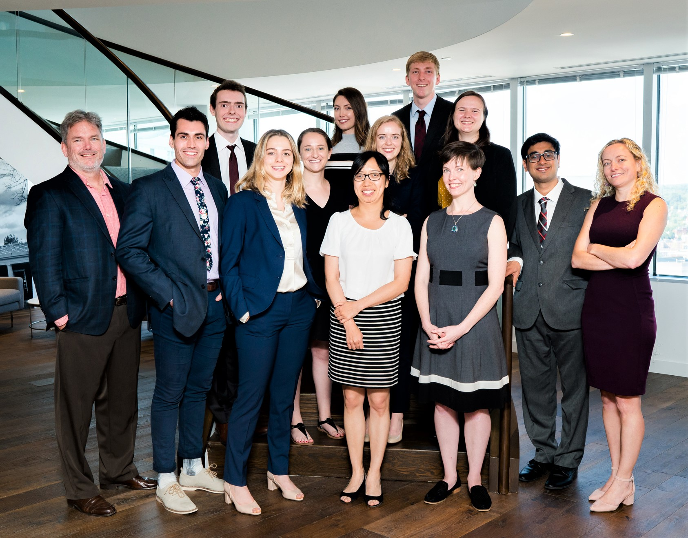
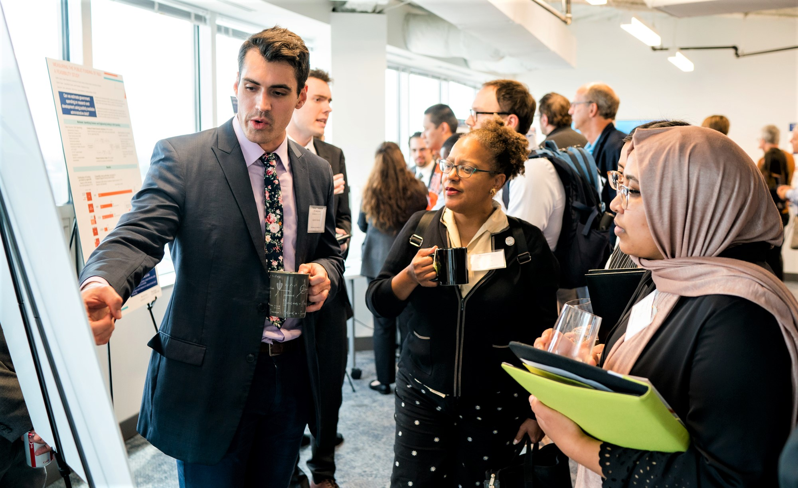

 
The University of Virginia’s Biocomplexity Institute and Initiative encompasses labs conducting research in all things biological, from genetics to public health policy. The [Social and Decision Analytics](https://biocomplexity.virginia.edu/social-decision-analytics) (SDAD) lab, strategically located in the D.C. metro area, works “in partnership with communities, academia, government and industry” towards data driven innovations in public policy with “statistical rigor and the creative application of social and decision analytics”.   

Within the SDAD Lab, The [Data Science for the Public Good](https://biocomplexity.virginia.edu/social-decision-analytics/dspg-program) (DSPG) program run by Drs. [Aaron Schroeder](https://biocomplexity.virginia.edu/aaron-schroeder) and [Gizem Korkmaz](https://biocomplexity.virginia.edu/gizem-korkmaz) offers a unique entrance into the complex world of policy and decision making for human beneficence. My role as a Graduate Fellow in the program has afforded me the opportunity to work in incredibly diverse teams, comprised of everything from Psychologists, Sociologists, and Economists to Healthcare Professionals, Computer Scientists and Statisticians, towards solutions to real world problems faced at the local and federal level. 
  

  

 
As a part of my pursuit towards a career in Public Health, a project that I’ve been working on and will continue to work on for my practicum comes from Fairfax County, VA, just across the Potomac from The National Mall. With the county’s sponsorship, we are creating CommunityScapes which “lay a foundation for a quantitative understanding of human health, habitat and well-being”. More specifically, we have been developing an Obesogenic Environment composite index utilizing data from the American Community Survey (Census), Fairfax County, and alternative open sources to quantify and understand the geospatial Social Determinants of Health which contribute to environments conducive to the development of obesity. The ultimate purpose of this index is to generate a robust scale with which the county can assess the temporal effectiveness of their policy initiatives and interventions from a variety of geographic perspectives. 

The experience has opened my eyes to a unique dimension of public health, in an environment budding with diverse fields of study, people, and ideas, which will influence my contributions to the fields of public health and biostatistics for the rest of my life. I would highly recommend this opportunity to anyone interested in new quantitative methods and applications for improving public health, living in the heart of public policy, Washington D.C. 
  

