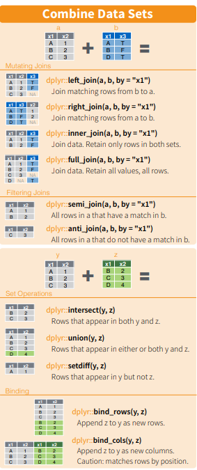
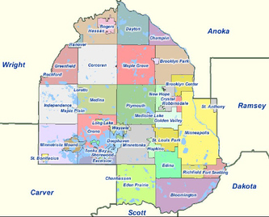

```{r setup, include = FALSE, echo = FALSE}
#Load the good stuff
library(tidyverse)
library(lubridate)
library(gt)
library(paletteer)
library(ggridges)
library(plotly)
library(gtExtras)
library(sf)
library(ggmap)
library(tidycensus)
library(leaflet)
library(osmdata)
library(tigris)
library(ggsflabel)
library(ggthemes)

#Working directory for .RMD
# knitr::opts_knit$set(echo = TRUE,
#                      root.dir = rprojroot::find_rstudio_root_file())

#Controlling figure output in markdown
knitr::opts_chunk$set(
#  fig.height =   
  fig.width = 6,
#  fig.asp = .5,
  out.width = "90%",
#  out.height = 
 fig.align  = "center",
  cache = TRUE,
  eval  = TRUE,
  echo  = TRUE,
  warning = FALSE
)

#My Colours (from viridis)
my_purple <- "#440154FF"
my_yellow <- "#FDE725FF"

#Set Theme for ggplot2
theme_set(theme_bw() + theme(plot.title = element_text(hjust = 0.5), legend.position = "bottom"))

#Set Scientific notation output and decimal places for knitr
options(scipen = 999)
options(digits = 4)
options(dplyr.summarise.inform = FALSE)

#Tidycensus api key
tidycensus::census_api_key("e0ffcaf3807b67c51c2ba9ba674afe9d33c6499e")
```

# I. Introduction {.jumbotron}  

$~$
$~$

## Where we've been --

The midterm assessment was designed to evaluate your 'fundamental' skills as a data scientist, corresponding to _Course Objectives_ (1)-(4,5) in the [syllabus](https://canvas.umn.edu/courses/293049/files?preview=26516582). Those skills break down into -- 

1. **Workflow** 
    - .Rprojects + Github, Rmarkdown, best `R` practices, reproducibility
2. **Data Wrangling**
    - `dplyr`, `tidyr`, `forcats`, `stringr`, `lubridate`
    - plus iteration with `purrr::map` family
3. **Data Visualization** 
    - `ggplot2`,`gt`
4. **Exploratory Data Analysis**
    - Use the above to read, explore, clean/tidy, prepare for analysis and visualize _new_ data   

$~$
$~$

## Where we're going --    

As we move forward this semester (today and after Spring Break 3/5 - 3/13), we will continuously utilize and extend these 'fundamental' skills to maximize `R` and Rstudio's potential for data science and analysis. With the aforementioned fundamentals in hand, we are going to learn how to use these 'advanced' communication and analysis tools --

5. **Enhanced Visualization** 
    - Interactivity w/ `ggplotly`, `reactable`
    - Enhance `gt` with `gtExtras` (and `flextable`, `ftExtra`)
    - Intro to `flexdashboard`
6. **Websites in R + Github**
    - Basics, personal webpage 
    - Websites as analytical display tools
        - Embedding `flexdashboard`
7. **Spatial Visualization** **(today)**
    - 'Tidy Maps' w/ `sf`or`sp` + `tidyverse` + `ggmaps` and `ggplot2`
    - Introduction to interactive maps with `ggplotly` and/or `leaflet`
8. **Shiny Apps**
    - Basics
    - Publish in an `R` hosted website
        - Embedding interactive `flexdashboards`
        - Embedding `shiny` apps
9. **Miscellaneous**
    - *Working with big data in R `dt_plyr`, `collapse`, `h2o`, `sparklyr`
    - *Working with databases in R `db_plyr`
    - *How to develop a package with Rstudio & Github
    - *Webscraping with R

$~$
$~$

# {.panel .panel-primary}
## {.panel-heading}
### So what exactly are we going to do today? {.panel-title}
## {.panel-body}


First, we're going to briefly cover joining multiple data sources with `dplyr` with spatial examples. Then we're going to build onto last week's lecture and expand our spatial data toolbox in `R` with more advanced use of `sf`, `ggmaps`, `tidycensus`, as well as an introduction to fully interactive `leaflet`. Finally, we will apply these tools in an activity where we create and edit more advanced spatial visualizations.  

```{r eval = FALSE}
#Install the packages for today if you don't already have them
install.packages(c("sf", "ggmap", "tmap", "tidycensus", "leaflet", "osmdata", "tigris"))
```

# II. Joining data in `R` {.jumbotron}  

Joining data from multiple sources is another aspect of *data wrangling* which was covered in PUBH 7461, but is an important part of working with real-world data that we should make sure we're on the same page about heading into the final project.  

Laura Le's wonderful lecture regarding joining data in R, as well as an example/activity with NYC flight data can be found on Canvas [here](https://canvas.umn.edu/courses/293049/pages/joining-data-with-dplyr).



# III. Advanced `sf`, `ggmap`, `tidycensus`, `ggplot`, `plotly` {.jumbotron}  

# Simple Features `sf` Resources   

Like many things in the `R` universe, the `sf` package has wonderful documentation and examples. Please spend some time reviewing these on your own.  

1. [Introduction](https://r-spatial.github.io/sf/articles/sf1.html)
2. [Reading, writing, converting Simple Features](https://r-spatial.github.io/sf/articles/sf2.html)
3. [Manipulating Simple Features](https://r-spatial.github.io/sf/articles/sf3.html)
4. [Plotting Simple Features](https://r-spatial.github.io/sf/articles/sf5.html)

# {.panel .panel-primary}
## {.panel-heading}
### Example 1. (MN) More advanced `sf` + `ggplotly`  {.panel-title}
## {.panel-body}  

First, let's download the `ggthemes` package for a few more thematic choices in our `ggplot`'s.  

```{r message = FALSE, warning = FALSE}
#Install ggrepel if necessary 
if (!require(ggthemes)) {
  install.packages("ggthemes", quiet = TRUE)
}

#Call the library
library(ggthemes, quietly = TRUE)
```


Next, let's read in our MN .shp file (from last week's lecture).  

```{r mn_read}
#Read in the shape file (don't make a tibble)
mn.df <- st_read("./data/USA_Counties/USA_Counties.shp", quiet = TRUE) %>%
  janitor::clean_names() %>%
  filter(state_name %in% "Minnesota")
```

Next, let's build our `ggplot` but add a little more information with our usual data wrangling skills and employ a better `ggthemes`.  

```{r mn_plot_1}
mn_pop.gg <- mn.df %>%
  dplyr::select(name, white:other, renter_occ, owner_occ, geometry) %>%
  rename(county = name) %>%
  pivot_longer(
    cols      = white:other, #tidy long data by category
    names_to  = "race_category",
    values_to = "race_pop"
  ) %>%
  mutate(
    race_category = str_replace_all(race_category, "_", " ") %>%
                    str_to_title() %>%
                    as_factor()
  ) %>%
  group_by(county) %>% #County level population
  mutate(county_pop = sum(race_pop)) %>%
  group_by(county, race_category) %>%
  summarise(
    perc_race = race_pop / county_pop,
    perc_rent = renter_occ / (renter_occ + owner_occ),
    geometry   = geometry
  ) %>%
  ungroup() %>%
  nest(data = c("race_category", "perc_race", "geometry")) %>%
  mutate(
    text_label = map_chr(.x = data, 
                     ~str_c(
                       "\n",
                       .x$race_category,
                       ": ", 
                       scales::percent(.x$perc_race, accuracy = 0.0001),
                       collapse = ""
                      )
                 ),
    text_label = str_c(county, "\nDemographics", text_label, "\nAvg. Rental Percentage: ", scales::percent(perc_rent, accuracy = 0.01))
  ) %>%
  unnest(data) %>%
  st_as_sf() %>%
  ggplot() +
  geom_sf(aes(fill = perc_rent, text = text_label),
          colour = "black", size = 0.8, alpha = 0.6) +
  labs(
    title = "2017 MN ACS Rent vs. Own % by County" 
  ) +
  scale_fill_viridis_c("Percent Rental", labels = scales::percent) +
  theme_map() +
  theme(
    plot.title   = element_text(size  = 24,
                                hjust = 0.5),
    legend.text  = element_text(size = 20),
    legend.title = element_text(size = 20),
    legend.position = "right"
  )


#Plotly
ggplotly(mn_pop.gg, 
         tooltip = "text",
         height  = 600,
         width   = 800) %>%
  style(hoveron = "fills")
```

# Advanced `tidycensus`  

## Working with `plotly` 

# {.panel .panel-primary}
## {.panel-heading}
### Example 2. (MN) More advanced `tidycensus` + `ggplotly` {.panel-title}
## {.panel-body}  

Request the ACS estimates for _median income_ in Hennepin County, MN, at the census tract level from the US census.gov via `tidycensus`.

```{r tidy_census, message = FALSE, warning = FALSE}
#Save the cache so you don't need to call the same API request over and over
options(tigris_use_cache = TRUE)

#Call the ACS API, returns a sf object
mn_income.df <- get_acs(
  geography = "tract",
  variables = "B19013_001", #Code for median income
  state     = "MN",
  county    = "Hennepin",
  year      = 2020,
  geometry  = TRUE
)
```

Now let's plot it with a nice theme and turn it into a plotly

```{r mn_income}
#Add a text label to mn_income.df
mn_income_plotly.df <- mn_income.df %>%
  mutate(
    tract      = str_split(NAME, ",") %>%
                 map_chr(1) %>%
                 str_remove("Census Tract "),
    text_label = str_c(
                  "Tract: ",
                  tract,
                  "\nMedian Income: ",
                  scales::dollar(estimate)
                 )
  )

#Generate the ggplot
income.gg <- ggplot() + 
  geom_sf(data = mn_income_plotly.df, 
          aes(fill = estimate, text = text_label),
          colour = "black", size = 0.1) + 
  labs(title = "Hennepin County, MN 2020 ACS Median Income") + 
  scale_fill_viridis_c("Median Income", labels = scales::dollar) +
  theme_map() +
  theme(
    plot.title   = element_text(size  = 16,
                                hjust = 0.5),
    legend.text  = element_text(size = 16),
    legend.title = element_text(size = 16),
    legend.position = "right"
  )


#Display
ggplotly(income.gg,
         tooltip = "text",
         height  = 600,
         width   = 800) %>%
    style(hoveron = "fills")
```

## Combining with `ggmap`  

# {.panel .panel-primary}
## {.panel-heading}
### Example 3. (MN) More advanced `ggmap` + `tidycensus` + `ggplotly` {.panel-title}
## {.panel-body}  

Now, let's take the same plot as above but overlay it onto a 'nice' map of MN with `ggmap`.  

For reference, [here](https://rdrr.io/cran/ggmap/man/get_map.html) is the complete documentation for the options and types of maps available with `ggmap`. Alternatively, a nice cheat sheet for `ggmap` can be found [here](https://www.nceas.ucsb.edu/sites/default/files/2020-04/ggmapCheatsheet.pdf)  

### 1. Create the base map  

```{r ggmap_base, message = FALSE}
#Get the bounding box and county outline
mn.box           <- osmdata::getbb("minnesota")
hennepin.box     <- osmdata::getbb("hennepin")
hennepin.outline <- osmdata::getbb("hennepin", format_out = "polygon")[[1]] %>%
  as_tibble() %>%
  rename(longitude = V1, latitude = V2)


#Get map from ggmap
#Get the base map (foundational layer)
mn_base.map <- get_map(
                location = hennepin.box,
                source   = "google",
                maptype  = "roadmap",
                crop = TRUE
               )

#Create the base map
hennepin_base.gg <- ggmap(mn_base.map) +
  geom_polygon(data = hennepin.outline, aes(x = longitude, y = latitude), colour = "black", size = 1.6, alpha = 0.1) +
  theme_map() +
  theme(
    plot.title   = element_text(size  = 16,
                                hjust = 0.5),
    legend.text  = element_text(size = 16),
    legend.title = element_text(size = 16),
    legend.position = "right"
  )
    
#Display base map
hennepin_base.gg
```

### 2. Add the income layer(s) from before and transform into `ggplotly`  

```{r ggmap_plotly, include = FALSE, results = "hide", echo = FALSE}
#First, need to make sure the coordinate systems between the ggmap and geom_sf match
coord_ggmap <- st_crs(hennepin_base.gg) #NA
coord_sf    <- st_crs(mn_income_plotly.df) #NAD83

#Overlay thge sf info from tidycensus ACS income estimates
mn_income.ggmap <- hennepin_base.gg +  
  geom_sf(data = mn_income_plotly.df, 
          aes(fill = estimate, text = text_label),
          colour = "black", size = 0.1,
          inherit.aes = FALSE) + 
  labs(title = "Hennepin County, MN 2020 ACS Median Income") + 
  scale_fill_viridis_c("Median Income", labels = scales::dollar) +
  theme_map() +
  theme(
    plot.title   = element_text(size  = 16,
                                hjust = 0.5),
    legend.text  = element_text(size = 16),
    legend.title = element_text(size = 16),
    legend.position = "right"
  )
```

```{r ggmap_plotly_2, eval = FALSE, echo = TRUE}
#First, need to make sure the coordinate systems between the ggmap and geom_sf match
coord_ggmap <- st_crs(hennepin_base.gg) #NA
coord_sf    <- st_crs(mn_income_plotly.df) #NAD83

#Overlay thge sf info from tidycensus ACS income estimates
mn_income.ggmap <- hennepin_base.gg +  
  geom_sf(data = mn_income_plotly.df, 
          aes(fill = estimate, text = text_label),
          colour = "black", size = 0.1,
          inherit.aes = FALSE) + 
  labs(title = "Hennepin County, MN 2020 ACS Median Income") + 
  scale_fill_viridis_c("Median Income", labels = scales::dollar) +
  theme_map() +
  theme(
    plot.title   = element_text(size  = 16,
                                hjust = 0.5),
    legend.text  = element_text(size = 16),
    legend.title = element_text(size = 16),
    legend.position = "right"
  )
```

```{r ggmap_plotly_3}
#Display plotly
ggplotly(mn_income.ggmap,
         tooltip = "text",
         height  = 600,
         width   = 800) %>%
    style(hoveron = "fills")
```

# Utilizing `dplyr` to join with other data   

While it's great that we can present a good-looking map with interactive features by census tract, census tracts themselves are not intuitive spatial groupings. However, _zipcodes_ and _cities_ are. What if we instead utilize `tidycensus` to pull zipcode spatial info and then join it with another data set which contains the zipcode, city, and county?  

# {.panel .panel-primary}
## {.panel-heading}
### Example 2. (MN) Joining `tidycensus` zipcode data with _city names_ {.panel-title}
## {.panel-body}  

First, read in the MN zipcode/city data (just pairs each zip code with it's city and county) and then request the ACS estimates for _median income_ across the entire U.S. by zipcode (only way to read in zipcode-level data via `tidycensus`). We must then *join* these two data sources *by zipcode* and then *filter* to retain only observations within Hennepin County, MN.

```{r tidy_census_zip, message = FALSE, warning = FALSE, eval = FALSE}
#Read in zipcode data
mn_zipcode.df <- read_csv("./data/mn_zipcodes.csv",
                          show_col_types = FALSE) %>%
                 mutate(
                   zip_code = as.character(zip_code),
                   county   = as_factor(county)
                 ) %>%
                 bind_rows(
                   .,
                   tibble(
                     zip_code = as.character(c(55344, 55346, 55347)),
                     city     = rep("Eden Prairie", 3),
                     county   = rep("Hennepin", 3) 
                   )
                 )

#Save the cache so you don't need to call the same API request over and over
options(tigris_use_cache = TRUE)

#Call the ACS API, returns a sf object
zipcode_income.df <- get_acs(
  geography = "zip code tabulation area",
  variables = "B19013_001", #Code for median income
  geometry  = TRUE
  ) %>%
  janitor::clean_names() %>%
  mutate(
    zipcode = str_remove(name, "ZCTA5 ")
  )
```


## Data join with `dplyr`  

Now that we have both data sources in our global environment, we have **(2)** possible ways of performing the aforementioned data join: (1) `left_join()` + `filter()` or (2) `inner_join()`. Are these the same thing??

```{r left_join_filter,  eval = FALSE}
#Left join the sf ACS data frame with city/zip df 
#There's a mismatch in variable names (zipcode vs. zip_code)....
#No problem!
mn_zip_city.df <- left_join(
                    zipcode_income.df, 
                    mn_zipcode.df, 
                    by = c("zipcode" = "zip_code") #zipcode in first, zip_code second
                  ) %>%
                  filter(county %in% "Hennepin")

#gt_preview
mn_zip_city.df %>%
  as_tibble() %>% #making a tibble for display
  dplyr::select(-geometry) %>% #removing for display purposes
  head() %>%
  gt()
```

Now, can we do the same thing with just one function instead of two?  

```{r inner_join, eval = FALSE}
#Inner join will perform both operations at once
mn_zip_city.df <- inner_join(
                    zipcode_income.df,
                    mn_zipcode.df,
                    by = c("zipcode" = "zip_code") #zipcode in first, zip_code second
                  )

#gt_preview
mn_zip_city.df %>%
  as_tibble() %>% #making a tibble for display
  dplyr::select(-geometry) %>% #removing for display purposes
  head() %>%
  gt()
```

Almost! We still need to filter by Hennepin county -- *however* if and when we are performing a similar data join on 'big data', **inner_join + filter** will be much more efficient in terms of memory than **left_join + filter**. Why?

```{r}
#Filter
#mn_zip_city.df <- mn_zip_city.df %>% filter(county %in% "Hennepin")
```

# {.panel .panel-primary}
## {.panel-heading}
### Example 3. (MN) Joining `tidycensus` zipcode data with _city names_ and turning into a `ggplotly` {.panel-title}
## {.panel-body} 

## Zipcode visualization  

Prep data for visualization...  

```{r  eval = FALSE, echo = TRUE}
#Add a text label to mn_income.df
mn_income_plotly.df <- mn_zip_city.df %>%
  mutate(
    text_label = str_c(
                  "City: ",
                  city,
                 "\nZipcode: ",
                  zipcode,
                  "\nMedian Income: ",
                  scales::dollar(estimate)
                 )
  )
```

Inital and add aesthetics...

```{r ggmap_plotly_zipcode, include = FALSE, results = "hide", echo = TRUE,  eval = FALSE}
#Overlay thge sf info from tidycensus ACS income estimates
mn_income.ggmap <- hennepin_base.gg +  
  geom_sf(data = mn_income_plotly.df, 
          aes(fill = estimate, text = text_label),
          colour = "black", size = 0.1,
          inherit.aes = FALSE) + 
  geom_path(data = hennepin.outline,
            aes(x = longitude, y = latitude),
            colour = "black", size = 1.2, alpha = 0.6,
            inherit.aes = FALSE) + 
  labs(title = "Hennepin County, MN 2020 ACS Median Income") + 
  scale_fill_viridis_c("Median Income", labels = scales::dollar) +
  theme_map() +
  theme(
    plot.title   = element_text(size  = 16,
                                hjust = 0.5),
    legend.text  = element_text(size = 16),
    legend.title = element_text(size = 16),
    legend.position = "right"
  )

#GGplot
mn_income.ggmap
```

```{r ggmap_plotly_2_zipcode, eval = FALSE, echo = TRUE}
#Overlay thge sf info from tidycensus ACS income estimates
mn_income.ggmap <- hennepin_base.gg +  
  geom_sf(data = mn_income_plotly.df, 
          aes(fill = estimate, text = text_label),
          colour = "black", size = 0.1,
          inherit.aes = FALSE) + 
  geom_path(data = hennepin.outline,
            aes(x = longitude, y = latitude),
            colour = "black", size = 1.2, alpha = 0.6,
            inherit.aes = FALSE) + 
  labs(title = "Hennepin County, MN 2020 ACS Median Income") + 
  scale_fill_viridis_c("Median Income", labels = scales::dollar) +
  theme_map() +
  theme(
    plot.title   = element_text(size  = 16,
                                hjust = 0.5),
    legend.text  = element_text(size = 16),
    legend.title = element_text(size = 16),
    legend.position = "right"
  )
```

Now, I figured out how to mess with the hoverinfo at the index/layer level via StackExchange. Originally, adding the `geom_path` outline of Hennepin county masked all the text labels 'behind' that layer and just said "Trace 702" on the side. The Trace numbers correspond to the it's "order" in the layers of the plot. For example, 1 is the base map (set to "none"). Thus, in order to control the hoverinfo of a particular layer in the plot, you simply need to change that indices hoverinfo to be "none" or "skip". Weirdly enough, I also believe if you want to change the $i^{\text{th}}$ Trace then you need to change the $(i + 1)^{\text{th}}$ layer. Normally I wouldn't do this in `for` loop but it's a lot easier here and there aren't many iterations.   

```{r ggmap_plotly_3_zipcode,  eval = FALSE}
#Create plotly
mn_income.ggplotly <- 
  ggplotly(mn_income.ggmap,
         tooltip = "text",
         height  = 600,
         width   = 800) %>%
    style(hoveron = "fills")

#Remove a layer's particular hover info (from stack exchange)
#Trace is 702 based on running the above mn_income.ggplotly
mn_income.ggplotly$x$data %>% map_chr("hoverinfo") -> hover_chr_vec #To check 

#Set replacement indices and values (same length, 702 + 1 = 703)
index <- c(3, 703)
replacement <- c("skip", "skip")

#For loop to replace index and info
for (i in 1:length(index)) {
  mn_income.ggplotly$x$data[[ index[i] ]]$hoverinfo <- replacement[i]
}

#Display
mn_income.ggplotly
```


And here is a map of the cities (from Google) for reference  -- 

<div style= "float : center; position : relative; top: 0px; width : 450px; height : 360px; padding-right: 24px; margin-bottom : 0px">

</div>

# Adding additional features (`osmdata` example)  

[Open Street Maps](https://www.openstreetmap.org/#map=4/38.01/-95.84) is an open source 'Wikipedia' of Google Maps; allowing us to pull a variety of geographic features from a location of interest. A full vignette for `osmdata` can be found [here](https://cran.r-project.org/web/packages/osmdata/vignettes/osmdata.html#1_Introduction). Please check the vignette out on your own time.  

In general, the process to access the OSM API via `osmdata`, and return an `sf` object, is given by  

```{r osm_ex, eval = FALSE}
#Open a query (opq) within a bbox of interest (getbb or lat/long)
osm_sf.df <- opq(bbox = "<place of interest>") %>% #Then add feature(s) of interest
             add_osm_feature(key = "<object classification>", value = "<subclassification>") %>% #Can also can input lat/lon coordingates
             osmdata_sf()
```

Here, `key =` things like highway, building, amenity, natural, etc. defining a broad class of geometric objects; and `value = ` defines the specific type or type(s) of highways, buildings, etc. you want to pull. [This nifty website](https://taginfo.openstreetmap.org/) contains a comprehensive list of keys and values for OSM.  

# {.panel .panel-primary}
## {.panel-heading}
### Example 4. (MN) More advanced `ggmap` + `tidycensus` + `osmdata` {.panel-title}
## {.panel-body}  

Here we're going to add a layer of points which describe a few different 'shop' types in Hennepin county. The lines below will also tell you what the available values are for a given key -- 

```{r eval = FALSE}
available_tags("shop")
```

```{r}
#Let's grab the liquor stores and hunting stores
osm_shop_sf.df <- opq(bbox = "hennepin") %>%
             add_osm_feature(key = "shop", value = c("alcohol", "supermarket", "books", "tattoo")) %>%
  osmdata_sf()
```

Let's check out the `sf` data frame of `osm_points` quickly -- 

```{r}
#Extract the relevent sf data frame
shop_points.df <- osm_shop_sf.df$osm_points %>% 
  janitor::clean_names() %>%
  filter(!is.na(shop)) %>% #only retain 'valid' tags
  dplyr::select(osm_id, name, shop, opening_hours, phone, website, geometry) %>%
  mutate(shop = str_to_title(shop) %>% as_factor())

#Check it out (minus geometry for display)
shop_points.df %>%
  as_tibble() %>%
  dplyr::select(-geometry) %>%
  gt_preview()
```


## Let's plot these store locations by type  

```{r}
#Let's add it to a hennepin_base.gg
hennepin_base.gg +
  geom_sf(data = shop_points.df,
          aes(colour = shop),
          inherit.aes = FALSE,
          alpha = 0.8, shape = 16) +
  labs(title = "Hennepin County, MN OSM Features") + 
  scale_colour_viridis_d("Store") +
  theme_map() +
  theme(
    plot.title   = element_text(size  = 16,
                                hjust = 0.5),
    legend.text  = element_text(size = 16),
    legend.title = element_text(size = 16),
    legend.position = "right"
  )
```

# IV. Leaflet {.jumbotron}  

# Introduction to `leaflet`  

Leaflet, like most things in the `R` universe also has great documentation and very nice vignette(s) to get you started. I'd reccommend first looking at the [Introduction](https://rstudio.github.io/leaflet/), then the [Basemaps](https://rstudio.github.io/leaflet/basemaps.html), [Markers](https://rstudio.github.io/leaflet/markers.html), [Popups and Labels](https://rstudio.github.io/leaflet/popups.html), and [Lines and Shapes](https://rstudio.github.io/leaflet/shapes.html).  

Today, we're only going to cover the Intro, Basemaps, Markers, and Popups. With respect to Basemaps, a comprehensive interactive tool demonstrating all the different types of Basemaps is given [here](https://leaflet-extras.github.io/leaflet-providers/preview/).  

The general steps for making a leaflet are very similar to `ggplot`/`ggplotly` -- 

1. Initialize `leaflet(data = )`
    - Can add individual data to each layer like `ggplot` as well
2. Add the Basemap with `addProviderTiles`
    - Types of Basemaps found [here](https://leaflet-extras.github.io/leaflet-providers/preview/)
3. Add geometric object(s)
    - `addMarkers()` for points
    - `addPolygons()` for shapes
    - `addPolylines()` for lines
4. Add a legend with `addLegend()`
5. Add a colour pallete
    - `colorNumeric()`
    - `colorFactor()`

# {.panel .panel-primary}
## {.panel-heading}
### Example 5. Transforming Example 4. (above) into a `leaflet` {.panel-title}
## {.panel-body}  

Let's add a leaflet with roughly the same aesthetics as above. Note that you can choose any pallete or manually pick colors as long as there are the same number of colors as discrete color choices.     

```{r}
#Call viridis library  
library(viridis, quietly = TRUE)

#Extract the levels/order of shop type factor
shop_types <- levels(shop_points.df$shop)
n_types    <- length(shop_types)

#Initialize our colour pallete (discrete in this case)
my_pallete <- colorFactor(viridis_pal(option = "D")(n_types), domain = shop_types)

#Call our leaflet
leaflet(data = shop_points.df) %>%
  addProviderTiles('CartoDB.Positron') %>% 
  addCircleMarkers(
    color   = ~my_pallete(shop_types),
    opacity = 0.4,
    weight  = 2, #outline strength
    radius  = 4 #size of circle
  ) %>%
  addLegend(
    title    = "Store Type",
    position = "bottomright",
    colors   = viridis_pal(option = "D")(n_types),
    labels   = shop_types 
  )
```


That looks pretty good, now let's add some labels!  

```{r}
#Need html tools to get our labels to render appropriately
library(htmltools, quietly = TRUE)

#Add a text label like normal
shop_label.df <- shop_points.df %>%
  mutate(
    text_label = str_c(
                   name,
                   "<br/>Store Type: ",
                   shop,
                   "<br/>Open Hours: ",
                   opening_hours,
                   "<br/>Phone: ",
                   phone,
                   "<br/>Website: ",
                   website
                 )
  )

#Redisplay the leaflet
leaflet(data = shop_label.df) %>%
  addProviderTiles('CartoDB.Positron') %>% 
  addCircleMarkers(
    color   = ~my_pallete(shop_types),
    label   = ~map(text_label, HTML), #map over labels, make html
    opacity = 0.4, #alpha
    weight  = 2, #outline strength
    radius  = 4 #size of circle
  ) %>%
  addLegend(
    title    = "Store Type",
    position = "bottomright",
    colors   = viridis_pal(option = "D")(n_types),
    labels   = shop_types 
  )
```

# V. Activity {.jumbotron}  

# {.panel .panel-success}
## {.panel-heading}
### Activity 1. Transform Example 4. into a `ggplotly` like in Example 3.  {.panel-title}
## {.panel-body}  

## The original `ggplot` in Example 4.  

```{r}
#The ggplot
hennepin_base.gg +
  geom_sf(data = shop_points.df,
          aes(colour = shop),
          inherit.aes = FALSE,
          alpha = 0.8, shape = 16) +
  labs(title = "Hennepin County, MN OSM Features") + 
  scale_colour_viridis_d("Store") +
  theme_map() +
  theme(
    plot.title   = element_text(size  = 16,
                                hjust = 0.5),
    legend.text  = element_text(size = 16),
    legend.title = element_text(size = 16),
    legend.position = "right"
  )
```

## Your `ggplotly` 

# {.panel .panel-success}
## {.panel-heading}
### Activity 2. Edit the leaflet in Example 5. {.panel-title}
## {.panel-body}  

## 1. Please replace `addCircleMarkers` with `addMarkers`  

**Hint** You'll have to remove the color scale (why?)

## 2. Please replace the colour with your own color of choice and `addAwesomeMarkers(..., icon = icons)`  

Follow the instructions from the [Markers](https://rstudio.github.io/leaflet/markers.html) vignette. [This Github Page](https://github.com/lennardv2/Leaflet.awesome-markers) also has a great documentation and links for the different libraries and types of icons out there.

Create the icon like so  

```{r eval = FALSE}
#Make the icon
icon.ion <- makeAwesomeIcon(icon = "home",
                            markerColor = 'darkpurple',
                            iconColor = "white",
                            library = "ion")
```

Then replace `addMarkers` with `addAwesomeMarkers` (*font awesome*) and add your own icon with `icon = ...`. You'll need to drop all the other options from addCircleMarkers as well as they don't apply anymore.  

## 3. Mess around with icons, colors, etc.  

Have fun messing around with `leaflet`!  