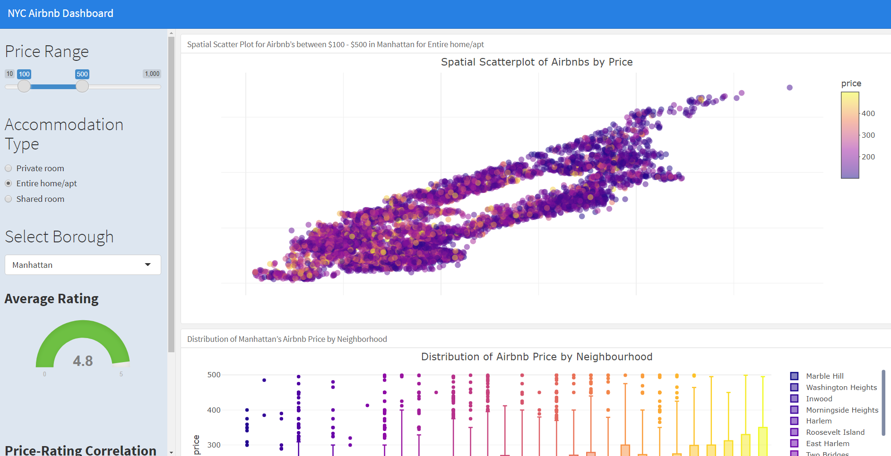
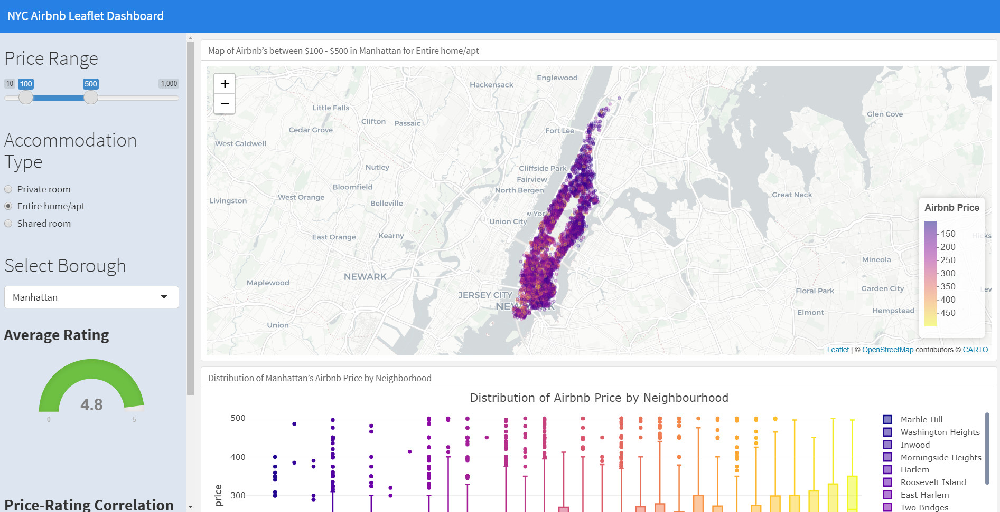
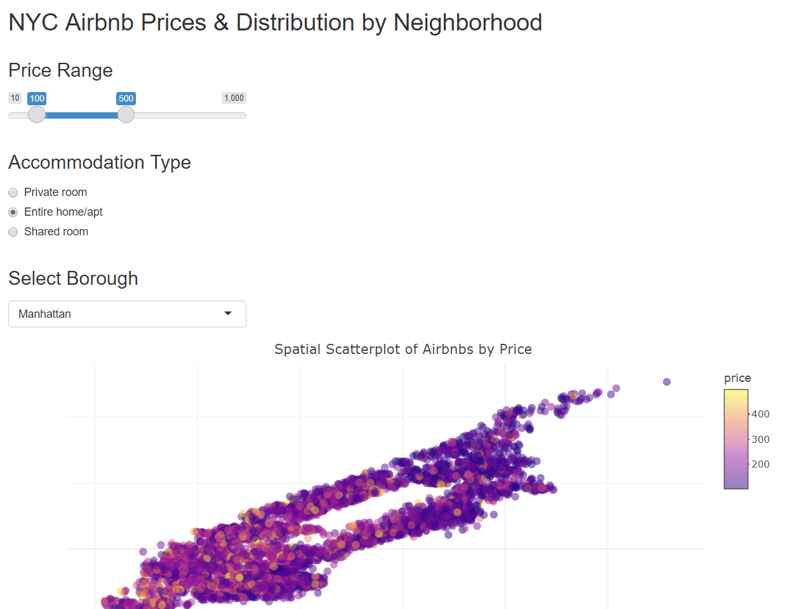

```{r setup, include = FALSE, echo = FALSE}
#Load the good stuff
library(tidyverse)
library(lubridate)
library(gt)
library(paletteer)
library(ggridges)
library(plotly)
library(gtExtras)
library(sf)
library(ggmap)
library(tidycensus)
library(leaflet)
library(osmdata)
library(tigris)
library(ggsflabel)
library(ggthemes)

#Working directory for .RMD
knitr::opts_knit$set(echo = TRUE,
                     root.dir = rprojroot::find_rstudio_root_file())

#Controlling figure output in markdown
knitr::opts_chunk$set(
#  fig.height =   
  fig.width = 6,
#  fig.asp = .5,
  out.width = "90%",
#  out.height = 
 fig.align  = "center",
  cache = FALSE,
  eval  = TRUE,
  echo  = TRUE,
  warning = FALSE
)

#My Colours (from viridis)
my_purple <- "#440154FF"
my_yellow <- "#FDE725FF"

#Set Theme for ggplot2
theme_set(theme_bw() + theme(plot.title = element_text(hjust = 0.5), legend.position = "bottom"))

#Set Scientific notation output and decimal places for knitr
options(scipen = 999)
options(digits = 4)
options(dplyr.summarise.inform = FALSE)
```

# I. Introduction {.jumbotron}  

$~$
$~$

## Where we've been --

The midterm assessment was designed to evaluate your 'fundamental' skills as a data scientist, corresponding to _Course Objectives_ (1)-(4,5) in the [syllabus](https://canvas.umn.edu/courses/293049/files?preview=26516582). Those skills break down into -- 

1. **Workflow** 
    - .Rprojects + Github, Rmarkdown, best `R` practices, reproducibility
2. **Data Wrangling**
    - `dplyr`, `tidyr`, `forcats`, `stringr`, `lubridate`
    - plus iteration with `purrr::map` family
3. **Data Visualization** 
    - `ggplot2`,`gt`
4. **Exploratory Data Analysis**
    - Use the above to read, explore, clean/tidy, prepare for analysis and visualize _new_ data   

$~$
$~$

## Where we're going --    

As we move forward this semester (today and after Spring Break 3/5 - 3/13), we will continuously utilize and extend these 'fundamental' skills to maximize `R` and Rstudio's potential for data science and analysis. With the aforementioned fundamentals in hand, we are going to learn how to use these 'advanced' communication and analysis tools --

5. **Enhanced Visualization** 
    - Interactivity w/ `ggplotly`, `reactable`
    - Enhance `gt` with `gtExtras` (and `flextable`, `ftExtra`)
    - Intro to `flexdashboard`
6. **Websites in R + Github**
    - Basics, personal webpage 
    - Websites as analytical display tools
        - Embedding `flexdashboard`
7. **Spatial Visualization**
    - 'Tidy Maps' w/ `sf`or`sp` + `tidyverse` + `ggmaps` and `ggplot2`
    - Introduction to interactive maps with `ggplotly` and/or `leaflet`
8. **Github Collaboration & Shiny Apps** (**today**)
    - Working with others in the same Github repository
        - Best practices
        - Branching, merging, merge conflicts
        - reseting to previous versions
    - **Developing a Shiny app for data communication**
    - **Developing a Shiny `flexdashboard`**
    - **Resources for more advanced Shiny**
9. **Miscellaneous**
    - package development
    - *Working with big data in R `dt_plyr`, `collapse`, `h2o`, `sparklyr`
    - *Working with databases in R `db_plyr`
    - *How to develop a package with Rstudio & Github
    - *Webscraping with R

$~$
$~$

# So what exactly are we going to do today?

## First, Dashboards!  

Today we're going to walk through a demonstration of creating a Shiny `flexdashboard` with the same NYC Airbnb data we've used previously for interactive visualization (`plotly`), as well as wrapping multiple plots into a single dashboard (`flexdashboard`). The syntax/layout of the dashboard is exactly the same as before, except now we'll add `runtime: shiny` to the `yaml` to indicate it's a reactive shiny application and then utilize the same `ui.R` input and `server.R` `render...({})` output functions to do so (without explicitly defining a ui or server, it's implied).  

In many ways, given our familiarity with `plotly` and `flexdashboards`, this avenue for interactive communication of data is 'easier' than building a full blown app because it respects the same .RMD `flexdashboard` structure.  

## Shiny Apps 

Last week I attempted to develop a spatial shiny app with `ggplot` + `ggplotly` + `tidycensus` + `ggmap` and it turned out to be an inadvisable pursuit for a couple of reasons -  (1) Renders way to slowly, (2) `plotly` syntax is preferable (renders faster) over `ggplotly`, (3) those specific types of maps have to be built with `ggplotly()`. This may happen to you as well while you are developing the final product(s) for your final projects. My reccomendations to avoid the slow rendering and unnecessary complications with `ggplotly` is to simply use `leaflet` if you're going to make that type of map -- they render almost instantaneously, are very user friendly, and play well with Shiny/dashboards.  

In that spirit, today we'll wrap the dashboard above into a regular shiny application (although I think the dashboard is a better tool for this specific communication tool). In addition, I'll also show how to embed a `leaflet` in both.  

> _**Good applications** supplement **good data science.**_

> _**Bad data science** creates **bad applications**, regardless of how **fancy.**_ 

$~$
$~$

# II. Developing a Shiny Dashboard {.jumbotron}  

Creating an interactive dashboard will require the use of two tools we are now pretty familiar with - `shiny` and `flexdashboard`. Now unlike the design of a Shiny apps, Shiny Dashboards will still be generated an `.RMD` (like the usual `flexdashboard`) with the only addition to the `yaml` being `runtime: shiny`. *However*, we still need to define the same `ui()` input and `server(input, output)` output functions within the document -- _but we don't define a ui or server **explicitly**_. Instead, we may simply utilize the associated input/output/render functions within "```{r}" chunks which are **implicitly** connected to a ui and a server.  

# Shiny Dashboard Template  

```{r eval = FALSE}
---
title: "Shiny Dashboard"
output: 
  flexdashboard::flex_dashboard:
    orientation: columns
    vertical_layout: fill
runtime: shiny
---

#```{r}
#library(shiny)
#```

Column {data-width=650}
-----------------------------------------------------------------------

### Chart A

Column {data-width=350}
-----------------------------------------------------------------------

### Chart B

### Chart C

```


So does the order of the input/render functions matter?? Yes! Just like a normal `.RMD`, it is run line by line or chunk by chunk so inputs have to come before outputs - but the communication between the server and ui is taken care of for you.  

# NYC Airbnb Shiny Dashboard Example  

Today's dashboard/example can be found on Canvas under Week 14 Lecture materials (`nyc_airbnb_shiny_dashboard.RMD`). Please download, unzip, and then extract the files inside that now unzipped folder -- open an R project and put the `.RMD` and `/data` folder there. In class I'm going to walk through the example(s) in depth but the general idea is we (1) Read/tidy the data (non-reactive) and store static variables, (2) Acquire user inputs via slider, buttons, drop-down-menus, etc. (a full list of ui widgets can be found [here](https://shiny.rstudio.com/gallery/widget-gallery.html)) and (3) Utilize *reactive* functions to access inputs and *render* interactive visualizations.  




## Some Important Notes  

1. Layout, structure, syntax, etc. remains the same as a normal `flexdashboard`/`.RMD`
2. **Static** operations and object storage should occur first.
    - These are things that don't/won't change with user input/interaction
3. **User Inputs** ought to be acquired next
    - Putting these in a `Column {.sidebar data-width=300}` seems like a good stylistic choice (as in the example)
4. **Reactive Operations** occur after input but before output
    - For example, if you want to access an object in multiple places based on the user input, rather than performing that operation within each of the subsequent reactive functions, you can simply pass that object throughout the document with a *user defined reactive function*
    - ex. `myFunction <- reactive({<your_operations>})`
4. **Reactive Output** will occur last (or at least after it's input has been acquired)
    - `reactive({<function of input>})` will allow you to access input variables anywhere in the document
        - See my inline examples for titles, etc. taken from user input
    - `render...` (i.e. `renderPlot`, `renderPlotly`, etc.) is a *reactive function*
        - Meaning that you can access any user input within the scope of the function
        - Can also access the output of any reactive function as well 
            - i.e. can call `renderPlotly({ myFunction() })` from above
5. It's difficult to trouble shoot reactive documents and functions
    - Can store "inputs" as static variables in the global environment while building dashboard
    - Build it one layer at a time (minimize the number of new things that can go wrong)
    - Will take some time to become familiar with these new reactive error messages (though a quick google usually helps)
    - Start simple, get a minimal working example up and running, and then add to it
6. **Themes** - when using themes from the bootswatch library (css library for your website themes) some formatting may not be respected
    - Can download the newest `/bslib` with this code `install.packages("remotes")`, `remotes::install_github("rstudio/bslib")`
    - Can add to the `yaml` just like a website (see below)
    
```{r eval = FALSE}
#YAML
---
title: "Shiny Dashboard"
output: 
  flexdashboard::flex_dashboard:
    orientation: columns
    vertical_layout: fill
    theme:
      version: 4 #version of bslib (3 is older, 4 new)
      bootswatch: <theme name> #flatly, darkly, etc.
runtime: shiny
---
```
    
# Leaflet & Shiny Dashboard

**Leaflet & Shiny** - If you intend to embed a `leaflet` app within a Shiny app or dashboard, this [Using Leaflet with Shiny](https://rstudio.github.io/leaflet/shiny.html) Rstudio website is an awesome resource to get you up and running.

## NYC Airbnb Shiny Dashboard Example  

While the dashboard above is pretty good, it'd be awesome to have a leaflet instead of a plotly spatial scatterplot (w/no map features due to `ggplotly`/`geom_sf`/`ggmap` bugs with shiny). Luckily, `shiny` can handle leaflets just fine with `renderLeaflet` and `leafletOutput` (the second is for Shiny apps only). This dashboard/example can also be found on Canvas under Week 14 Lecture materials (`nyc_airbnb_shiny_dashboard_leaflet.RMD`) 




# III. Developing a Shiny App (cont.) {.jumbotron}  

Today we will mostly be walking through a reasonable workflow for developing Shiny applications in a clear, orderly fashion. To do so, please go to Canvas Week 14 Lecture Materials and download the associated .zip file. Please unzip and extract the contents into an `.Rproject`. When opening the project in your local directory, instead of just clicking the generic `New Project` at the top of the drop down, click the `Shiny App` third from the top. This will initilize a project that *expects* a Shiny app, comes with that same pre-built tutorial, etc. *Note - don't put Shiny app and Shiny dashboard in the same directory/project or in nested directories/projects (why?), ensure that the directories are distinct and disjoint*.  

# Files, Sourcing, and Functions  

Now, unlike the usual `.RMD` files we're used to working with and knitting, for Shiny apps we're actually only going to use `.R` scripts. We've been using `.RMD`'s both to generate static/interactive documents and ensure **reproducibility** of our work. When working with `.R` scripts, it's a good idea to periodically clear your global environment (broom icon) and rerun your script to ensure it's reproducible.

When developing a Shiny app or any other more complicated workflow, application, etc., it is a good idea to separate distinct project/app functions and operations into their own distinct `.R` files with a `/src` folder or other file structure outside the root directory. These can be data acquisition steps, data wrangling, visulazation, user functions, etc. which can called/run via the `ui.R`, `server.R`, or other 'meta'-script via `source(<my_file>.R)` (`render()` if .RMD). Why might this be a good idea?

*Hint - Think about Github collaboration, file structure, and reactive programming*  

# NYC Airbnb Example   

From a raw coding perspective, there aren't many differences between the dashboard above and a 'regular' shiny app; almost all of the important input, reactive, and render functions are identical. However, *structurally* they are very different in design, file-structure, and most importantly, **explicit interaction between the ui & server**.  

## Reminder  

### `ui.R`  

Here we define the layout, structure, user inputs, and output display.  

### `server.R`  

As a reactive function of `input` and `output`, this is where are the computation, visualization, and heavy lifting take place. In this example, we take in the user inputs from the `ui.R` and use them to generate the desired visualizations and outputs -- sending them back to the `ui.R` for display/interaction.  

All that really means is within the `ui.R`, you need to include the same inputs *while also explicitly displaying the output from the server*. And a small technical detail is that different input functions or display functions need to be seperated by comma. Likewise, within the server all reactive and render functions operate the same, however you have to **explicitly store output objects** you'd like to be passed back to the `ui.R`.  



# V. Conclusion & Resources {.jumbotron}  

For the purposes of this course, and for most of the applications we are all likely to need Shiny as a communication tool for in the future, I think the Shiny Dashboard is probably the way to go. If you're already familiar with `.RMD` and `flexdashboard`, it's an easier, better-looking way to maximize R/Shiny as a communication tool. However, it's important to know both since on the backend, Shiny Dashboards are still running the `ui.R` $\longleftrightarrow$ `server.R` connection under the hood.  

# Publishing Shiny Apps & Dashboards (to include in your website)  

Hosting a Shiny App or dashboard on your website (indirectly) can be down pretty easily with **shinyapp.io**. Unfortunately, you can't share or display these reactive tools like normal -- in order for something to be reactive in the `R` language it has to be hosted on a server (not the script, an actual server) which supports `R` (i.e. can run it in the background to host your app).  

Unfortunately Github and consequently Github Pages does no support `R` this way, *so you can't simply embed it in your website like a dashboard or leaflet* (why?)  

But that's okay! You can still display your Shiny apps on your website or elsewhere, you just need to host it elsewhere.  

Here is a [shinyapps.io](https://shiny.rstudio.com/articles/shinyapps.html) tutorial to do just that! Following the directions will allow you to deploy a Shiny app on your group's or personal website.  

Alternatively, [here](https://statsandr.com/blog/how-to-publish-shiny-app-example-with-shinyapps-io/) is an another step-by-step screenshot guide for setting up and hosting with `shinyapps.io`.  

# Resources  


- [Shiny with Flexdashboard tutorial](https://pkgs.rstudio.com/flexdashboard/articles/shiny.html) vignette/tutorial
- [Examples of Shiny Dashboards](https://pkgs.rstudio.com/flexdashboard/articles/examples.html)
- [shinyapps.io set up](https://shiny.rstudio.com/articles/shinyapps.html)
- Here is an [awesome gallery](https://shiny.rstudio.com/gallery/) of Shiny apps for motivation, inspiration, or just awe.  
- Here is [Rstudio's official Shiny App tutorial](https://shiny.rstudio.com/tutorial/) before next week's class
- Here is a slightly shorter, [interactive tutorial](https://deanattali.com/blog/building-shiny-apps-tutorial/) from Dean Attali  

$~$
$~$

# V. Activity {.jumbotron}  

# {.panel .panel-success}
## {.panel-heading}
### Activity 1. Edit the Shiny Dashboard {.panel-title}
## {.panel-body}

Similarly to Week 7 Lecture's Activity, 

For today's activity, please 

1. Start an .Rproject in the folder of your choice
2. Download the [NYC shiny dashboard .zip](https://canvas.umn.edu/courses/293049/pages/week-14-shiny-apps-and-dashboards-ii?module_item_id=7930621) from Canvas
3. Unzip and put the `.RMD` and `/data` folde in that project
4. Click `Run Document` at the top (where `Knit` usually is) to run the app and check it out on your own
5. Then, alter the (3) visualization below (as directed)

## (1) Spatial Scatterplot/Leaflet by __Rating__

Instead of looking at price, alter the scatter plot/leaflet to be coloured by rating. 

## (2) Distribution of __Rating__ by Neighbourhood  

Instead of looking at the distribution of prices, let's investigate the distribution of ratings by neighbourhood instead. Fix the title(s) accordingly. 

## (3) Number of __Avg. Listings per Month__ by Neighborhood  

$~$
$~$


# VI. Next Week {.jumbotron}

1. I will schedule group meetings (2) prior to the final project due date based on your groups submitted availability.
2. Meeting 1 will be next week.
3. You should have a reasonable amount of EDA done prior to the meeting
    - All this means is you've evaluated the validity of the data to answer your questions of interest
    - You've inspected the data for issues with cleaning or tidying
    - It would be good to have some very basic, preliminary (probably static) visualizations
4. Start thinking about/laying the ground work for more advanced applications
5. We're going to cover *R Package Development* via github next week (and maybe some other miscellaneous topics
    - This will allow people not just to see your work on github, but download it directly and run your examples/code/etc. 


