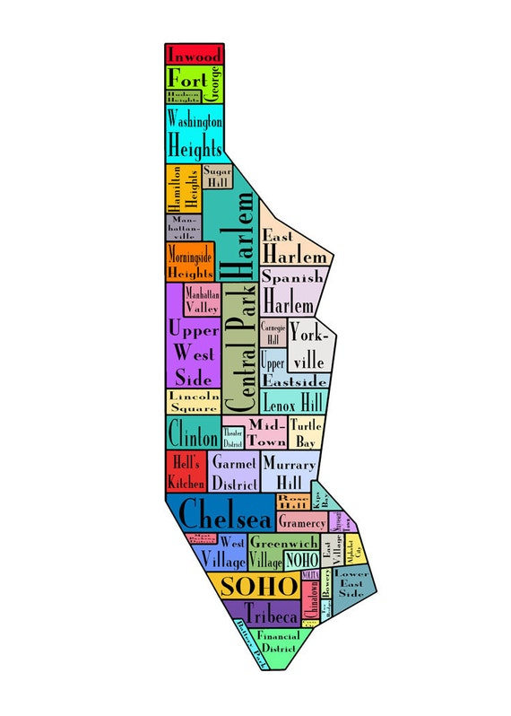
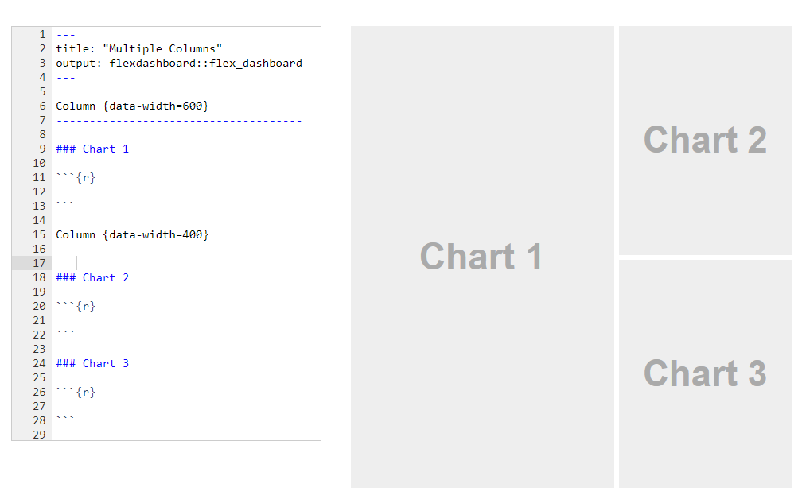

```{r setup, include = FALSE, echo = FALSE}
library(tidyverse)
library(lubridate)
library(gt)
library(paletteer)
library(ggridges)
library(plotly)
library(gtExtras)

#Working directory for .RMD
# knitr::opts_knit$set(echo = TRUE,
#                      root.dir = rprojroot::find_rstudio_root_file())

#Controlling figure output in markdown
knitr::opts_chunk$set(
#  fig.height =   
  fig.width = 6,
#  fig.asp = .5,
  out.width = "90%",
#  out.height = 
 fig.align  = "center",
  cache = TRUE,
  eval  = TRUE,
  echo  = TRUE,
  warning = FALSE
)

#My Colours (from viridis)
my_purple <- "#440154FF"
my_yellow <- "#FDE725FF"

#Set Theme for ggplot2
theme_set(theme_bw() + theme(plot.title = element_text(hjust = 0.5), legend.position = "bottom"))

#Set Scientific notation output and decimal places for knitr
options(scipen = 999)
options(digits = 4)
options(dplyr.summarise.inform = FALSE)
```

# I. Introduction {.jumbotron}  

$~$
$~$

## Where we've been --

The midterm assessment was designed to evaluate your 'fundamental' skills as a data scientist, corresponding to _Course Objectives_ (1)-(4,5) in the [syllabus](https://canvas.umn.edu/courses/293049/files?preview=26516582). Those skills break down into -- 

1. **Workflow** 
    - .Rprojects + Github, Rmarkdown, best `R` practices, reproducibility
2. **Data Wrangling**
    - `dplyr`, `tidyr`, `forcats`, `stringr`, `lubridate`
    - plus iteration with `purrr::map` family
3. **Data Visualization** 
    - `ggplot2`,`gt`
4. **Exploratory Data Analysis**
    - Use the above to read, explore, clean/tidy, prepare for analysis and visualize _new_ data   

$~$
$~$

## Where we're going --    

As we move forward this semester (today and after Spring Break 3/5 - 3/13), we will continuously utilize and extend these 'fundamental' skills to maximize `R` and Rstudio's potential for data science and analysis. With the aforementioned fundamentals in hand, we are going to learn how to use these 'advanced' communication and analysis tools --

5. **Enhanced Visualization** (today)
    - Interactivity w/ `ggplotly`, `reactable`
    - Enhance `gt` with `gtExtras` (and `flextable`, `ftExtra`)
    - Intro to `flexdashboard`
6. **Spatial Visualization**
    - 'Tidy Maps' w/ `sf`or`sp` + `tidyverse` + `ggmaps` and `ggplot2`
    - Introduction to interactive maps with `ggplotly` and/or `leaflet`
7. **Websites in R + Github**
    - Basics, personal webpage 
    - Websites as analytical display tools
        - Embedding `flexdashboard`
8. **Shiny Apps**
    - Basics
    - Publish in an `R` hosted website
        - Embedding interactive `flexdashboards`
        - Embedding `shiny` apps
9. **Miscellaneous**
    - *Working with big data in R `dt_plyr`, `collapse`, `h2o`, `sparklyr`
    - *Working with databases in R `db_plyr`
    - *How to develop a package with Rstudio & Github
    - *Webscraping with R

$~$
$~$

# {.panel .panel-primary}
## {.panel-heading}
### So what exactly are we going to do today? {.panel-title}
## {.panel-body}

Today we're going to explore a couple of new packages, how they can be used to _enhance_ our visualizations, and see some examples/tutorials for how to use these tools effectively.  

1. Learn how to enhance `gt` tables with `gtExtras`
    - With a brief intro to `flextable`, an alternative to `gt`
2. Introduce 'interactive' tables with `reactable`
3. Learn how to enhance `ggplot` with interactivity through `ggplotly`
4. Introduce dashboards with `flexdashboard`
5. Do an activity which --
    - Turns (3) `ggplot`'s into `ggplotly`'s
    - Creates a simple `flexdashboard` of those (3) `ggploty`'s  

$~$

# Important note about interactive plots & advanced tools -- {.alert .alert-dismissable .alert-danger}

In terms of creating _good_, _effective_, and _reproducible_ data pipelines, analyses, and visualizations, __the 'fundamentals' are much more important than the 'advanced' tools__. Step one in an analytical/visualization workflow is to get your fundamentals in order, produce some high quality static plots _first_; then when you have all your proverbial 'ducks in a row', extend those fundamentals with enhanced, interactive visualizations, websites, shiny apps, etc.  

$~$
$~$

# II. Enhanced Tables {.jumbotron}  

$~$
$~$

# `gtExtras`  

Now, as we've seen previously, `gt` is a very functional table framework which works very well with the `tidyverse`. Like many of you who have asked questions about convey more complex, nuanced information in a `gt` then `gtExtras` is for you!  

`gtExtras` is an extremely new/under-development package compared to others we have used thus far, which means we'll have to download the package directly from Github instead of CRAN as usual. To do so,  

```{r eval = FALSE}
#Install developer tools, allows us to access github seamlessly 
if (!require(devtools)) {
  install.packages("devtools")
}

#Install via github
devtools::install_github("jthomasmock/gtExtras")

#Call the library just to make sure it all went fine
library(gtExtras)
```

# {.panel .panel-warning}
## {.panel-heading}
### Warning: If you're having issues installing `gtExtras` due to dependencies not updating {.panel-title}
## {.panel-body}

When it prompts you to update any outdated dependencies, you select yes and then installation fails -- if you see something like "Warning: cannot remove prior installation of package ‘rlang’" (which I did), it's an easy fix. First, restart R and close all projects, instances, etc. Then, locate where your `/R` folder exists which contains all the packages (`~/R/win-library/4.1` for me on Windows), manually delete the folder then go back to a new `R` session, restart `R` just to make sure, and then `install.packages("rlang")` and that should do the trick.  

$~$

# Some cool gtExtras features  

The full vignette (with examples) for `gtExtras` can be found [here](https://jthomasmock.github.io/gtExtras/). We're going to explore it briefly as a class, so please take the time to do so on your own if you couldn't make it to class.  

Here are just a few of the most useful features in this package -- 

- Add themes like in `ggplot` with `gtExtras::gt_theme_...`
- Colour multiple columns across rows `gt_colour_rows`
- Easily highlight rows or columns `gt_highlight_row`, `gt_highlight_cols`
- Add barplot columns inside tables with `gt_bar_plot`  


# {.panel .panel-primary}
## {.panel-heading}
### Example 1. (Lakers 08-09, Week 6 Lecture) Enhancing an old `gt` with `gtExtras` {.panel-title}
## {.panel-body}

```{r include = FALSE}
#Load the data
library(lubridate)
data(lakers)

#Convert to date/times appropriately
lakers.df <- lakers %>%
  mutate(
    date    = ymd(date),
    time    = ms(time),
    etype   = as.factor(etype),
    type    = case_when(
               type %in% "3pt"           ~ "3 Pointer",
               str_detect(type, "layup") ~ "Layup",
               str_detect(type, "dunk")  ~ "Dunk",
               str_detect(type, "jump")  ~ "Jumpshot",
               TRUE                      ~ "Other"
              ),
    month   = month(date, label = TRUE, abbr = TRUE),
    dow     = wday(date, #day of the week
                   label = TRUE, #return name i.e "Friday"
                   abbr  = FALSE, #Return full name
                   week_start = getOption("lubridate.week.start", 1)), #1 = Monday
    quarter = period
  ) %>%
  dplyr::select(-period)

#Remove lakers for clarity
remove(lakers)

#Nested example
sht_pct.df <- lakers.df %>%
  filter(etype %in% "shot", quarter %in% 1:4) %>%
  mutate(result = (result %in% "made")) %>%
  nest(-c(date, type)) %>% #collapse by date/game & type
  mutate(
    sht_pct = map_dbl(.x = data, ~mean(.x$result)) #mean is numeric so map_dbl
  ) %>%
  unnest(data) %>% #Expand back to full 
  group_by(month, type) %>%
  summarise(
    across(
    .cols = sht_pct,
    .fn   = list(
             Avg.   = mean,
             Median = median,
             SD     = sd
            ),
    na.rm  = TRUE,
    .names = "{.fn} Shooting Pct." 
    )
  ) 

#Original gt
sht_pct.gt <- sht_pct.df %>%
  ungroup() %>%
  mutate(
    type = fct_reorder(type, `Avg. Shooting Pct.`, .desc = TRUE) #reorder for arrangement
  ) %>%
  rename(Month = month, `Shot Type` = type) %>%
  group_by(Month) %>%
  arrange(Month, `Shot Type`) %>% #By month and then shot type (which has been reordered above)
  gt_preview(top_n = 5, bottom_n = 5) %>%
  tab_header("Monthly Summaries of Shooting Percentage by Type") %>%
  fmt_percent( #Make everything numeric a percentage
    columns   = where(is.numeric), #can select specific cols if not all pct
    decimals  = 1
  ) %>%
  summary_rows(
    groups  = NULL, #No group summary, just total
    columns = contains("Avg"),
    fns = list(
        `Season Avg. Weighted by Type` = ~mean(., na.rm = TRUE) #like map(.x, ~) syntax
      ),
    formatter = fmt_percent, #Format like fmt_percent above
    decimals  = 1, #pass the same arguments like above
  ) %>%
  tab_source_note("Data from Laker's 2008-2009 Season courtesy of lubridate")
```

## The original monthly shooting summary `gt`  

```{r}
#Original gt
sht_pct.gt %>%
  data_color(
    columns = `Avg. Shooting Pct.`,
    colors = scales::col_numeric(
      palette = c("white", my_purple),
      domain  = c(0, 1)
    )
  )
```


## An enhanced version  

```{r}
#Enhanced gt with gtExtras
sht_pct.gt %>%
  gt_color_rows( #Colour multiple columns at once
    columns = contains("Shooting"),
    palette = "ggsci::red_material", #paleteer
  #  palette = c("white", my_purple),
    use_paletteer = TRUE #Turn this false to use manual colors
  )  %>%
  gt_theme_nytimes() %>% #NY Times theme
  gt_highlight_rows(
    rows = c(5, 11), #3 pointers, lowest percentage
    fill = "blue4", #blue as in
    alpha = 0.24,
    bold_target_only = TRUE,
    target_col = c(`Shot Type`, `Avg. Shooting Pct.`)
    )
```

# Sparklines: Plotting inside a `gt`  

Now, `gt_sparkline()` might be the most interesting and useful function inside of `gtExtra`: it embeds a column of associated `ggplot`'s in a `gt`, via a `list.column`. Have no feat though! The 'fundamental' skills like `nest`, `map`, `group_by` + `summarise` allow us to work easily with columns, and thus sparklines.  

An in depth vignette with examples using `gt` and `gt_sparkline` may be found [here](https://jthomasmock.github.io/gtExtras/articles/plots-in-gt.html). We're going to explore it briefly as a class, so please take the time to do so on your own if you couldn't make it to class.  

# {.panel .panel-primary}
## {.panel-heading}
### Example 2. (Disney Land Reviews) Enhancing an old `gt` with `gtExtras::gt_sparklines` {.panel-title}
## {.panel-body}

```{r include = FALSE}
#Read and clean disney df
disney.df <- read_csv("./data/disneyland_reviews.csv",
                      na = c("missing"),
                      show_col_types = FALSE) %>%
             janitor::clean_names() %>%
             rename(
               id       = review_id,
               text     = review_text, #trimming unnecessary review_
               location = reviewer_location
             ) %>% 
             mutate( #Time
               id    = as.factor(id),
               date  = lubridate::ym(year_month), #Cleaning up time as date, y/m factors
               year  = lubridate::year(date) %>% #See the lubridate package
                       as.factor(),
               month = month.name[lubridate::month(date)] %>%
                       as.factor()
             ) %>%
             mutate( #Text analysis
               n_words    = str_split(text, " ") %>% #proxy for number of words
                            map_dbl(length),
               avg_length = str_split(text, " ") %>% #proxy for average length
                            map(str_length) %>% 
                            map_dbl(mean),
               n_unique   = str_split(text, " ") %>% #proxy for no. unique words
                            map(unique) %>%
                            map_dbl(length),
               branch     = str_split(branch, "_") %>% #extracting branch w stringr
                            map_chr(2) %>%
                            as.factor() %>%
                            fct_recode("Hong Kong" = "HongKong") %>%
                            fct_relevel("California", "Paris")
             ) %>%
             dplyr::select(id, rating, location, branch, everything(), -c(year_month, text))

#Original gt
review.gt <- disney.df %>%
  group_by(branch, location) %>%
  summarise(
    avg_rating = mean(rating),
    N          = n()
  ) %>%
  arrange(branch, desc(N)) %>%
  group_by(branch) %>%
  slice(1:5) %>%
  arrange(branch, desc(avg_rating), desc(N)) %>%
  rename(
    `# Reviews`          = N,
    `Average Rating`     = avg_rating,
    `Location of Origin` = location) %>%
  gt() %>%
  tab_header("Top 5 Reviewer Locations by Branch") %>%
  tab_footnote(
    footnote = "Reviews extracted from Trip Advisor 2010-2019",
    locations = cells_column_labels(
      columns = `Average Rating`
    )
  ) %>%
    data_color(
    columns = `# Reviews`,
    colors = scales::col_numeric(
      palette = c("white", "red"),
      domain  = c(0, max(`# Reviews`) + 100)
    )
  ) %>%
  data_color(
    columns = `Average Rating`,
    colors = scales::col_numeric(
      palette = c("blue", "white", "red"),
      domain  = c(min(`Average Rating`) - 0.4, 
                  max(`Average Rating`))
    )
  )
```


## Original `gt`  

```{r}
#Original gt
review.gt <- disney.df %>%
  group_by(branch, location) %>%
  summarise(
    avg_rating = mean(rating),
    N          = n()
  ) %>%
  arrange(branch, desc(N)) %>%
  group_by(branch) %>%
  slice(1:5) %>%
  arrange(branch, desc(avg_rating), desc(N)) %>%
  rename(
    `# Reviews`          = N,
    `Average Rating`     = avg_rating,
    `Location of Origin` = location) %>%
  gt() %>%
  tab_header("Top 5 Reviewer Locations by Branch") %>%
  tab_footnote(
    footnote = "Reviews extracted from Trip Advisor 2010-2019",
    locations = cells_column_labels(
      columns = `Average Rating`
    )
  ) %>%
    data_color(
    columns = `# Reviews`,
    colors = scales::col_numeric(
      palette = c("white", "red"),
      domain  = c(0, max(`# Reviews`) + 100)
    )
  ) %>%
  data_color(
    columns = `Average Rating`,
    colors = scales::col_numeric(
      palette = c("blue", "white", "red"),
      domain  = c(min(`Average Rating`) - 0.4, 
                  max(`Average Rating`))
    )
  )

#Original gt
review.gt
```


## Enhanced `gt`  


In order to add sparklines to our table, we'll need to create a _list column_ for all of the values of interest in our summarise statement (remember `tibble`'s like list columns).  

#### Enhance data wrangling with list column  

```{r}
#New and improved gt
sparkline.gt <- disney.df %>%
  group_by(branch, location) %>%
  summarise(
    avg_rating = mean(rating),
    N          = n(),
    `Rating Distribution` = list(rating) #Create a list col of values, make sure it's named well here
  ) %>%                       #So we can plot each list
  arrange(branch, desc(N)) %>%
  group_by(branch) %>%
  slice(1:5) %>%
  arrange(branch, desc(avg_rating), desc(N)) %>%
  rename(
    `# Reviews`          = N,
    `Average Rating`     = avg_rating,
    `Location of Origin` = location) %>%
  gt() %>%
  tab_header("Top 5 Reviewer Locations by Branch") %>%
  tab_footnote(
    footnote = "Reviews extracted from Trip Advisor 2010-2019",
    locations = cells_column_labels(
      columns = `Average Rating`
    )
  ) %>%
    data_color(
    columns = `# Reviews`,
    colors = scales::col_numeric(
      palette = c("white", "red"),
      domain  = c(0, max(`# Reviews`) + 100)
    )
  ) %>%
  data_color(
    columns = `Average Rating`,
    colors = scales::col_numeric(
      palette = c("blue", "white", "red"),
      domain  = c(min(`Average Rating`) - 0.4, 
                  max(`Average Rating`))
    )
  )
```

### Now let's enhance our `gt` with sparklines & a `gtExtra` theme    

As of now, there are only lineplot (sparkline), density, histogram, or barplot; I'm sure more will be developed soon.  

```{r}
#New and improved gt
sparkline.gt %>%
  gt_sparkline(`Rating Distribution`, 
               type       = "histogram", 
               line_color = "white", 
               fill_color = "coral1", 
               bw         = 1) %>%
  gt_theme_nytimes() #NY Times theme
```

# Alternatives to `gt`  

## `reactable`  

The vignette for `reactable` may be found [here](https://glin.github.io/reactable/index.html), a whole host of examples [here](https://glin.github.io/reactable/articles/examples.html), demos [here](https://glin.github.io/reactable/articles/twitter-followers/twitter-followers.html), and reference for package functions [here](https://glin.github.io/reactable/reference/index.html). We're going to explore these briefly as a class, so please take the time to do so on your own if you couldn't make it to class.  

### Key Takeaways from `reactable`

#### Pros  

- Highly functional, includes ability to use HTML and Javascript
- Ability for user to interactively sort by column
- Ability to search a table
- Pagination
- Ability to Group/Aggregate interactively
- Custom Rendering
- It basically produces a self-contained Shiny app/widget


#### Cons  

- Highly functional but at the cost of being highly complex with unique syntax
- Doesn't necessarily play well with the `tidyverse`
- Need to have a basic knowledge of HTML or Javascript to maximize the packages potential
- While you can make 'interactive' tables with `reactable`, there's rarely a need to do so
    - Unless you're developing webpages specifically designed to explore data
- Lot's of the minor functionality can be performed with `gt` + `gtExtras`  
- All functionality can also be done directly in Rshiny 

## `flextable`  

An entire online _book_ written by David Gohel on using the `flextable` package can be found [here](https://ardata-fr.github.io/flextable-book/). We're going to explore these briefly as a class, so please take the time to do so on your own if you couldn't make it to class.  

### Key Takeaways from `flextable`  

I am a little biased towards `gt` as it's newer, similar to `ggplot`, is `tidyverse` friendly, and is being rapidly developed to increase it's functionality. However, `flextable` has some notable advantages to `gt` at present and can be more functional in a variety of ways. You'll never be required to make one in this course, but it may be useful for your final project or in developing Rshiny apps later in the course.  

#### Pros  

- Can knit to .html, .docx, .ppt, and .pdf
- Consistent, _relatively_ easy to follow syntax
- Slightly more customizable than `gt`
- Appears to work well with Rshiny
- Comprehensive, well maintained, established

#### Cons  

- Not `tidyverse` friendly in the same way as `gt`
- Doesn't operate like `ggplot` (while `gt` does)
- Though `gt` is much newer (less developed) than `flextable`, it's already nearly as functional and I expect that gap to close soon 
    - Minus the ability to create .docx, .pdf, or .ppt
- However, the ability to create the above documents isn't that necessary as you can write out any `gt` as a .jpg or .png and embed it any of those file types easily and reproducibly  


$~$
$~$

# III. Interactivity w/ `ggplotly`{.jumbotron}  

$~$
$~$

I am huge fan of `ggplotly` -- it really maximizes the use of `ggplot` as a professional, industry ready visualization tool. In fact, `plotly` is much larger than just the `R` universe, with implementations in Python, Julia, Matlab, Javascript, and others. However, it's interface with `ggplot2` specifically may be the easiest to utilize (if you have good 'fundamentals'!). The official website for `ggplotly` can be accessed [here](https://plotly.com/ggplot2/), with all the resources, examples, tutorials you could ever desire. We're going to explore it briefly as a class, so please take the time to do so on your own if you couldn't make it to class.  
\tiny
 _*Note_ - I also found out that dplyr does have a function to manipulate variable names like strings in the tidyverse. I'll use it in an example below, the function is `rename_with(.cols, .fn = function(x) {})`
\normalsize

Quick example --

```{r}
#Example tibble
tibble(
  patient_id         = 1,
  review_score       = 5,
  location           = "U.S.",
  disney_land_branch = "California"
) %>%
  rename_with(
    .cols = everything(), # select cols
    .fn   =  function(x) { #supply function to apply across cols
              str_replace_all(x, "_", " ") %>%
              str_to_title()
             }
  )
```


# Intro to `ggplotly` syntax  

```{r message = FALSE}
#Install ggplotly if necessary 
if (!require(plotly)) {
  install.packages("plotly")
}

#Call the library
library(plotly)
```

Now, before we get into passing `ggplot2` objects directly into `plotly`, it's important to have a basic understanding of the difference in `plotly` syntax. While good 'fundamentals' will generally be able to allow you to pass `ggplots` directly, there are times where you _may_ need to edit the plot on the other end of things in `plotly` syntax.  

# {.panel .panel-primary}
## {.panel-heading}
### Example 3. (NYC Airbnb Scatterplot) Introduction to `ggplotly` syntax {.panel-title}
## {.panel-body}

First, let's read in these NYC Airbnb data (acquired in 2017), tidy it up, and filter by "Entire homes or apartments" which have ratings, are price under $1000/night, and are on the island of Manhattan.  

```{r warning = FALSE, message = FALSE}
#plotly
library(plotly)

#Read in the nyc airbnb data set
nyc_airbnb.df <- read_csv("./data/nyc_airbnb.csv", show_col_types = FALSE) %>%
  mutate(rating = review_scores_location / 2) %>%
  filter(
    neighbourhood_group %in% "Manhattan",
    room_type %in% "Entire home/apt",
    (!is.na(rating)),
    price <= 1000
  ) %>%
  dplyr::select(neighbourhood, rating, price,
                room_type, lat, long, contains("review"))
```


### Spatial Scatterplot (we will improve this when we do mapping!)  

Let's make a spatial scatterplot, with a point for each listing and a label which describes the neighborhood, price, rating, and number of reviews of that particular listing.  

```{r}
nyc_airbnb.df %>%
  mutate(
    text_label = str_c(neighbourhood, 
                       "\nPrice - $"  ,  price, 
                       "\nRating - ",    rating,
                       "\n# Reviews - ", number_of_reviews)
  ) %>%
  plot_ly(
    x     = ~lat,
    y     = ~long,
    type  = "scatter", 
    mode  = "markers", #This is geom_point, 'lines' = geom_line
    color = ~price,
    text  = ~text_label,
    alpha = 0.4
  ) %>%
  layout(
    title  = "Spatial Scatterplot of Manhattan Airbnb's by Price",
    xaxis  = list(title = "Latitude"),
    yaxis  = list(title = "Longitude"),
    legend = list(title = "Price") #Not working?
  )
```


# {.panel .panel-primary}
## {.panel-heading}
### Example 4. (NYC Airbnb Boxplot) Introduction to `ggplotly` syntax {.panel-title}
## {.panel-body}

For reference, here is an artistic map of the neighborhoods in nyc -- 



### Pricing Boxplots  

Next, let's look at the distribution of pricing by neighborhood. Note that you can double click on an item in the legend to isolate it, or single click to remove or add items to the plot.  

```{r fig.align = "center"}
nyc_airbnb.df %>%
  mutate(
    neighbourhood = fct_reorder(neighbourhood, price, median, .desc = FALSE)
  ) %>%
  plot_ly(
    x      = ~price,
    color  = ~neighbourhood,
    type   = "box",
    colors = "viridis" 
  ) %>%
  layout(
    title  = "Distribution of Manhattan's Airbnb Price by Neighbourhood",
    xaxis  = list(title = "Price")
  )
```

# {.panel .panel-primary}
## {.panel-heading}
### Example 5. (NYC Airbnb Barplot) Introduction to `ggplotly` syntax {.panel-title}
## {.panel-body}

### Barchart of Number of Listings per Neighborhood Coloured by avg. rating  

Here I wanted to colour the bars by their average rating but order them by number of listings, however `plot_ly` didn't like that so I stuck with colouring by neighbourhood.

```{r}
nyc_airbnb.df %>%
  group_by(neighbourhood) %>%
  summarise(
    N             = n(),
    `Avg. Rating` = mean(rating) # Wanted to colour by avg. rating but it didn't like that
  ) %>%
  mutate(
    neighbourhood = fct_reorder(neighbourhood, N, .desc = FALSE)
  ) %>%
  plot_ly(
    x = ~neighbourhood,
    y = ~N,
    color  = ~neighbourhood,
    type   = "bar",
    colors = "viridis"
  ) %>%
  layout(
    title  = "Number of Listings by Neighbourhood",
    xaxis  = list(title = "Neighbourhood"),
    yaxis  = list(title = "Number of Listings")
  )
```

More details are given on their website above and Google can solve most any issues you may run into with `plotly` - it's a widely and professionally used piece of software.

# Passing `ggplot2 %>% ggplotly()`  

Now, if we have done a thorough job tidying, wrangling, and handling strings, factors, and date/time objects in our data, it's very easy to turn our usual, beautiful `ggplot`'s into a `plotly` object with `%>% ggplotly()`  

# {.panel .panel-primary}
## {.panel-heading}
### Example 6. (NYC Airbnb Scatterplot) `ggplot %>% ggplotly()` {.panel-title}
## {.panel-body}

### Spatial Scatterplot (we will improve this when we do mapping!)  

```{r}
#Our usual ggplot
scatter.gg <- 
  nyc_airbnb.df %>%
  mutate(
    text_label = str_c(neighbourhood, #add as text aesthetic
                       "\nPrice - $"  ,  price, 
                       "\nRating - ",    rating,
                       "\n# Reviews - ", number_of_reviews)
  ) %>%
  ggplot(aes(x = lat, y = long, colour = price, text = text_label)) +
  geom_point(alpha = 0.25) +
  coord_cartesian() +
  scale_colour_viridis_c("Price") +
  labs(
    title = "Spatial Scatterplot of Manhattan's Airbnb Prices",
    x     = "Latitude",
    y     = "Longitude"
  ) + 
  theme(legend.position = "right")
  
#ggplotly() + tooltip to control label
ggplotly(scatter.gg, tooltip = "text") #tooltip controls text hover/label
```

# {.panel .panel-primary}
## {.panel-heading}
### Example 7. (NYC Airbnb Boxplot) `ggplot %>% ggplotly()` {.panel-title}
## {.panel-body}

### Distribution of Airbnb Pricing by Neighbourhood

```{r fig.width = 6}
#Make our usual ggplot
price_dist.gg <- nyc_airbnb.df %>%
  mutate(
    neighbourhood = fct_reorder(neighbourhood, price, median, .desc = FALSE)
  ) %>%
  ggplot(aes(x = neighbourhood, y = price, fill = neighbourhood)) +
#  geom_violin(alhpa = 0.4, scale = "width", trim = FALSE) +
  geom_boxplot(alpha = 0.8, colour = "black", width = 2) +
  labs(
    title = "Distribution of Manhattan's Airbnb Price by Neighbourhood",
    x     = "Price"
  ) +
  scale_fill_viridis_d("Neighbourhood") +
  theme(legend.position = "right") +
  theme(axis.text.x = element_text(angle = 90, hjust = 1))

#Pass it to ggplotly
ggplotly(price_dist.gg)
```

# {.panel .panel-primary}
## {.panel-heading}
### Example 8. (NYC Airbnb Barplot) `ggplot %>% ggplotly()` {.panel-title}
## {.panel-body}

### Barchart of Number of Listings per Neighborhood Coloured by Avg. Rating

```{r fig.height = 6}
#Make our usual barplot
bar.gg <- nyc_airbnb.df %>%
  group_by(neighbourhood) %>%
  summarise(
    N          = n(),
    avg_rating = mean(rating) 
  ) %>%
  ungroup() %>%
  mutate(
    neighbourhood = fct_reorder(neighbourhood, N, .desc = FALSE),
    text_label    = str_c(neighbourhood, #add as text aesthetic
                          "\nAvg. Rating - ", round(avg_rating, 2), 
                          "\n# Reviews - ",   N)
  ) %>%
  ggplot(aes(x = neighbourhood, y = N, fill = avg_rating, text = text_label)) +
  geom_bar(stat = "identity") +
  coord_flip() +
  labs(
    title = "Manhattan Listings by Neighbourhood and Avg. Rating",
    y     = "Neighbourhood",
    x     = "Number of Listings"
  ) +
  scale_fill_viridis_c("Avg. Rating", 
                       option = "magma", 
                       alpha = 0.8, 
                       limits = c(4, 5)) +
  theme(legend.position = "right")

#And let's turn it into a plotly object!
ggplotly(bar.gg, tooltip = "text")
```

# IV. Introduction to `flexdashboard` {.jumbotron}  

Creating a basic `flexadeshboard` is relatively straightforward, as well as embedding it into a website or shiny app (will learn this soon!). Today, we are just going to create a relatively simple dahsboard (.RMD template on Canvas [here]()) to turn a couple of our nice `ggplot`'s into `ggplotly`'s and create a cohesive dashboard.  

First, install the package if you haven't already -- 

```{r}
#Install developer tools, allows us to access github seamlessly 
if (!require(flexdashboard)) {
  install.packages("flexdashboard")
}
```

Then, a general template takes the form of an .RMD file that looks like so, and produces a layout like the table on the right --



Fill in the R chunks with plots (and any data cleaning in an `include = FALSE` chunk above), and viola! Knit the document and a dashboard should appear.  

- The `flexdashboard` basics are located [here](https://pkgs.rstudio.com/flexdashboard/articles/flexdashboard.html) (where the template is taken from)
- More rigorous detail about layouts & structure can be found [here](https://pkgs.rstudio.com/flexdashboard/articles/flexdashboard.html), 
- More advanced topics like themes can be accessed [here](https://pkgs.rstudio.com/flexdashboard/articles/theme.html) (will spend time on this later in the semester)
- Examples of cool `flexdashboards` can be found [here](https://pkgs.rstudio.com/flexdashboard/articles/examples.html)  

# V. Activity  

# {.panel .panel-success}
## {.panel-heading}
### Activity 1. `ggplotly` plus `flexdashboard` {.panel-title}
## {.panel-body}

For today's activity, please 

1. Start an .Rproject in the folder of your choice
2. Download the [flexdashboard .RMD template](https://canvas.umn.edu/courses/293049/pages/week-7-lecture-2?module_item_id=7596145) from Canvas
3. Download the [NYC Airbnb data](https://canvas.umn.edu/courses/293049/pages/week-7-lecture-2?module_item_id=7596145) from Canvas and put it in the `/data` folder 
4. Then, alter the (3) `ggplot`'s or `ggplotly`'s below (as directed)
5. Transform each into a `plotly` with `ggplotly()` if it's not already
6. Insert the (3) `ggplotly`'s into the `R` chunks 
    - Mess around with the order/structure, `fig.height`, `fig.width` etc.  
    
## Data Read  

```{r data_read}
#Read in the nyc airbnb data set
nyc_airbnb.df <- read_csv("./data/nyc_airbnb.csv", show_col_types = FALSE) %>%
  mutate(rating = review_scores_location / 2) %>%
  filter(
    neighbourhood_group %in% "Manhattan",
    room_type %in% "Entire home/apt",
    (!is.na(rating)),
    price <= 1000
  ) %>%
  dplyr::select(neighbourhood, rating, price,
                room_type, lat, long, contains("review"))
```


## (1) Spatial Scatterplot by __Rating__

Instead of looking at price, alter the scatter plot to be coloured by rating. Fix the title(s) and text_label accordingly.

```{r fig.width = 6}
#Our usual ggplot
scatter.gg <- 
  nyc_airbnb.df %>%
  mutate(
    text_label = str_c(neighbourhood, #add as text aesthetic
                       "\nPrice - $"  ,  price, 
                       "\nRating - ",    rating,
                       "\n# Reviews - ", number_of_reviews)
  ) %>%
  ggplot(aes(x = lat, y = long, colour = price, text = text_label)) +
  geom_point(alpha = 0.25) +
  coord_cartesian() +
  scale_colour_viridis_c("Price") +
  labs(
    title = "Spatial Scatterplot of Manhattan's Airbnb Prices",
    x     = "Latitude",
    y     = "Longitude"
  ) + 
  theme(legend.position = "right")
  
#ggplotly() + tooltip to control label
scatter.plotly <- ggplotly(scatter.gg, tooltip = "text") #tooltip controls text hover/label
```


## (2) Distribution of __Review per Month__ by Neighbourhood  

Instead of looking at the distribution of prices, let's investigate the distribution of ratings by neighbourhood instead. Fix the title(s) accordingly.  

```{r fig.width = 6}
box.plotly <- nyc_airbnb.df %>%
  mutate(
    neighbourhood = fct_reorder(neighbourhood, price, median, .desc = FALSE)
  ) %>%
  plot_ly(
    x      = ~price,
    color  = ~neighbourhood,
    type   = "box",
    colors = "viridis" 
  ) %>%
  layout(
    title  = "Distribution of Manhattan's Airbnb Price by Neighbourhood",
    xaxis  = list(title = "Price")
  )
```

## (3) Number of Listings by Neighbourhood, Coloured by __Average Price__  

Let's instead colour the plot by __Average Price__. Fix the title(s), label(s) accordingly.  

```{r fig.height = 6}
#Make our usual barplot
bar.gg <- nyc_airbnb.df %>%
  group_by(neighbourhood) %>%
  summarise(
    N          = n(),
    avg_rating = mean(rating) 
  ) %>%
  ungroup() %>%
  mutate(
    neighbourhood = fct_reorder(neighbourhood, N, .desc = FALSE),
    text_label    = str_c(neighbourhood, #add as text aesthetic
                          "\nAvg. Rating - ", round(avg_rating, 2), 
                          "\n# Reviews - ",   N)
  ) %>%
  ggplot(aes(x = neighbourhood, y = N, fill = avg_rating, text = text_label)) +
  geom_bar(stat = "identity") +
  coord_flip() +
  labs(
    title = "Manhattan Listings by Neighbourhood and Avg. Rating",
    y     = "Neighbourhood",
    x     = "Number of Listings"
  ) +
  scale_fill_viridis_c("Avg. Rating", 
                       option = "magma", 
                       alpha = 0.8, 
                       limits = c(4, 5)) +
  theme(legend.position = "right")

#And let's turn it into a plotly object!
bar.ggplotly <- ggplotly(bar.gg, tooltip = "text")
```