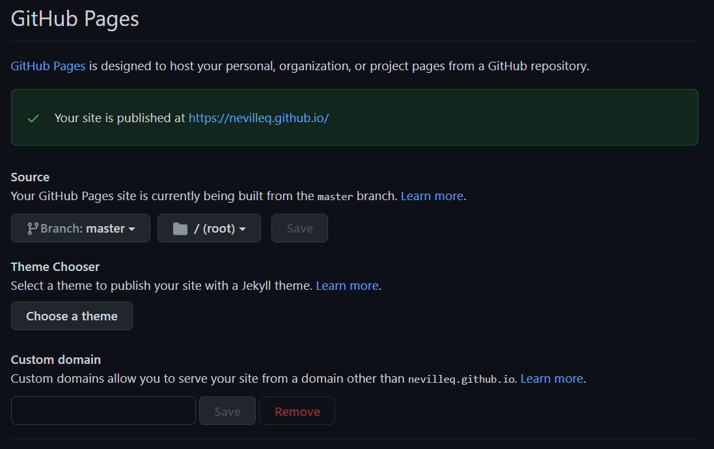

```{r setup, include = FALSE, echo = FALSE}
library(tidyverse)
library(lubridate)
library(gt)
library(paletteer)
library(ggridges)
library(plotly)
library(gtExtras)

#Working directory for .RMD
# knitr::opts_knit$set(echo = TRUE,
#                      root.dir = rprojroot::find_rstudio_root_file())

#Controlling figure output in markdown
knitr::opts_chunk$set(
#  fig.height =   
  fig.width = 6,
#  fig.asp = .5,
  out.width = "90%",
#  out.height = 
 fig.align  = "center",
  cache = TRUE,
  eval  = TRUE,
  echo  = TRUE,
  warning = FALSE
)

#My Colours (from viridis)
my_purple <- "#440154FF"
my_yellow <- "#FDE725FF"

#Set Theme for ggplot2
theme_set(theme_bw() + theme(plot.title = element_text(hjust = 0.5), legend.position = "bottom"))

#Set Scientific notation output and decimal places for knitr
options(scipen = 999)
options(digits = 4)
options(dplyr.summarise.inform = FALSE)
```

# I. Introduction {.jumbotron}  

$~$
$~$

## Where we've been --

The midterm assessment was designed to evaluate your 'fundamental' skills as a data scientist, corresponding to _Course Objectives_ (1)-(4,5) in the [syllabus](https://canvas.umn.edu/courses/293049/files?preview=26516582). Those skills break down into -- 

1. **Workflow** 
    - .Rprojects + Github, Rmarkdown, best `R` practices, reproducibility
2. **Data Wrangling**
    - `dplyr`, `tidyr`, `forcats`, `stringr`, `lubridate`
    - plus iteration with `purrr::map` family
3. **Data Visualization** 
    - `ggplot2`,`gt`
4. **Exploratory Data Analysis**
    - Use the above to read, explore, clean/tidy, prepare for analysis and visualize _new_ data   

$~$
$~$

## Where we're going --    

As we move forward this semester (today and after Spring Break 3/5 - 3/13), we will continuously utilize and extend these 'fundamental' skills to maximize `R` and Rstudio's potential for data science and analysis. With the aforementioned fundamentals in hand, we are going to learn how to use these 'advanced' communication and analysis tools --

5. **Enhanced Visualization** 
    - Interactivity w/ `ggplotly`, `reactable`
    - Enhance `gt` with `gtExtras` (and `flextable`, `ftExtra`)
    - Intro to `flexdashboard`
6. **Websites in R + Github** (*today*)
    - Basics, personal webpage 
    - Websites as analytical display tools
        - Embedding `flexdashboard`
7. **Spatial Visualization**
    - 'Tidy Maps' w/ `sf`or`sp` + `tidyverse` + `ggmaps` and `ggplot2`
    - Introduction to interactive maps with `ggplotly` and/or `leaflet`
8. **Shiny Apps**
    - Basics
    - Publish in an `R` hosted website
        - Embedding interactive `flexdashboards`
        - Embedding `shiny` apps
9. **Miscellaneous**
    - *Working with big data in R `dt_plyr`, `collapse`, `h2o`, `sparklyr`
    - *Working with databases in R `db_plyr`
    - *How to develop a package with Rstudio & Github
    - *Webscraping with R

$~$
$~$

# {.panel .panel-primary}
## {.panel-heading}
### So what exactly are we going to do today? {.panel-title}
## {.panel-body}

Today we're going to learn how to create and host a website with R and Github Pages, as well as how to embed a `flexdashboard` inside of a webpage. We will focus on setting y'all up to create your own personal website (homework) but with aim at extension to websites as analytical/data communication tools.  

# II. Website Tutorial {.jumbotron}  

At it's core, hosting a website in `R` with Github boils down to 3 main components -- 

1. .Rproject $\longleftrightarrow$ Github connection (Github Pages)
2. _.yaml_ which controls the knitting/rendering/building of the website (just like normal)
3. _.RMD_ files knitted to _.html_ pages (like any other website)  

# Step 1. Initialize Github Repository  

- For today, we're going to initialize an example website repo entitled `example.github.io`
- The ending `.github.io` let's Github know automatically that it's a website
- Not necessary, but makes life easier
- Website names are case sensitive so _keep everything lower case_
- Connect a local .Rproject/directory to this repo like normal  

# Step 2. Basics  

The two most important and necessary features of a website, at least in `R`, are the **_.yaml_** (directions) and **_index.RMD_** (home page). Again, case sensitive so make sure everything is lower case and that the yaml file is called `_site.yaml` (the `_` prevents name masking).  

Now, download the [website_template.zip](https://canvas.umn.edu/courses/293049/pages/week-9-lecture) from the Week 9 Lecture materials on Canvas. In the `_site.yaml` file, you'll see the following instructions which control the website -- 

```{r eval = FALSE}
name: "Yay internet!"
header-includes: 
  \usepackage{graphicx}
  \usepackage{float}
output_dir: "."
navbar:
  title: "Home"
  right:
    - text: "About"
      href: about.html
    - icon: fa-envelope fa-lg
      href: mailto:<nevil066@umn.edu>
    - icon: fa-github fa-lg
      href: http://github.com/nevilleq/
output:  
   html_document:
    theme: flatly
```

The `name:` is somewhat irrelevant, and the `header-includes:` statement is just calling some LaTex packages which allow pictures to "float" if you're familiar (not super important).  

However, what IS important is the  

- `output_dir = "."` (.Rproject root directory)
- `navbar:` starts the navigation bar at the top of the website  
- `title:` defines the name of the "Home Button"
- `right:` simply means put what follows on the right of the navbar
- `text:` again is the name of the button
- `href:` is the "web reference", i.e. an .html file or link
- `icon:` defines a button with a picture (mail for email, etc.)
    - A full list of these icons from 'Font Awesome' can be found [here](https://fontawesome.com/icons) (*hint: LinkedIn*)
- `output:` like normal, want `.html`  
- `theme:` comes from these Bootswatch .CSS files
    - These themes are all found in the `/site_libs` folder
    - These and more can be downloaded from Bootswatch [here](https://bootswatch.com/3/)  

# {.panel .panel-warning}
## {.panel-heading}
### Important Things to Remember {.panel-title}
## {.panel-body}

#### 1. *yaml* Scoping Matters  

'Scoping' here refers to the horizontal alignment of each line in the _yaml_. You'll notice that everything in the _yaml_ has a "nested" structure, in that every sub-option, sub-button, sub-directory, etc. is __1 tab__ to the right. When introducing more nested drop down buttons (which we will do later, and you will do on the hw).  

#### 2. You must have a `_site.yaml` and `index.RMD`/`index.html`  

#### 3. You can `href` any knitted .html of any kind (including dashboards!)  

# Step 3. Initialize your website/repo  

## First, go to the top navbar in Rstudio to the 'Build' tab and make sure the website knits all files together for each 'Build'  

Located in between 'Session' and 'Debug', click on it and select 'Configure Build Tools...'. It should automatically detect that you're working on a website, but if not, click the drop down 'Project Build Tools' and select 'Website'. *Check the box entitled: 'Re-knit current preview when supporting files change'*. This will ensure that when you change one .RMD/.html or the .yaml, it will re-knit all 'supporting' files such that links between pages will still function properly.  

## Next, there are 2 options to 'Build' the website  

1. Type this into the console to 'Build' your website  

```{r eval = FALSE}
rmarkdown::render_site(encoding = "UTF-8")
```

2. Close and re-open the project, go to tab (top right by default) which normally has 'Environment', 'Git', etc. and you should now see a 'Build' tab. Click on it, you should see a button that says 'Build' with a hammer next to it in the upper left of that window/pane. Click on it and that's it! (it will run the line of code above in the console)  

## Add, commit, pull, push  

## Finally go back to your repository on Github  

1. Refresh and navigate to the repository 'Settings' (right hand side)
2. Scroll down to 'GitHub Pages' and click on the link
3. Set the GitHub pages source to the _main branch_  



4. Refresh the webpage and you should see a green check mark above indicating 'Your site is published at <your-web-address>'
5. Click on that link, that's your website!  

# Useful tips and tricks  

Including links is as easy as `[link name](url)` and pictures can be included with `` (though it can be easier to use .html, there are two examples in the template).  

Remember to change the 'Build' settings to 'Re-knit' when file dependencies change to ensure your websites links, buttons, menus, etc. all 'knit' and 'work' together. _You will need to do this everytime you change any files_. 

If you want to add a drop down menu, all you have to add to the yaml is this  
```{r eval = FALSE}
name: "Yay internet!"
header-includes: 
  \usepackage{graphicx}
  \usepackage{float}
output_dir: "."
navbar:
  title: "Home"
  right:
    - text: "New Button"
      menu:
          - text: "New Drop Down Button"
            href: whatever.html
    - text: "About"
      href: about.html
    - icon: fa-envelope fa-lg
      href: mailto:<nevil066@umn.edu>
    - icon: fa-github fa-lg
      href: http://github.com/nevilleq/
output:  
   html_document:
    theme: flatly
```

You need to push your changes to Github before you will see them change on the web.  

You may need to refresh the cache/cookies or delete all browsing history from the last hour in order to see changes immediately on the web.

# Additional Resources  

If you'd like to mess around with other Bootswatch themes [here](https://community.rstudio.com/t/in-rstudio-rmarkdown-how-to-add-new-html-themes-from-bootswatch/15791)'s an RCommunity Thread for adding different Bootswatch themes.  

If you'd like to know more about websites with R, [here](https://bookdown.org/yihui/rmarkdown/rmarkdown-site.html)'s a great chapter from _Rmarkdown: The Definitive Guide_.  

If you need a little extra help or if you'd like to peruse a different tutorial, [here](http://nickstrayer.me/RMarkdown_Sites_tutorial/) is another great one. 

# III. Activity {.jumbotron}  

# {.panel .panel-success}
## {.panel-heading}
### Activity 1. Embed your dashboard from last lecture's activity into your example website {.panel-title}
## {.panel-body}

In order to embed a `flexdashboard` into a website, the website's `_site.yaml` and the dashboard's `yaml` conflict; and the site's instructions supersede the dashboards. In order to get around this, you can simply render with this command  

```{r eval = FALSE}
rmarkdown::render("dashboard_template.RMD", output_format = "flexdashboard::flex_dashboard")
```

After rendering, rebuild the website and you should be good to go!  

# IV. Final Project {.jumbotron}  

Refer to the [syllabus](https://canvas.umn.edu/courses/293049) for more specific details about the entire project. 

Today, we have covered the underlying fundamentals of building a website with dashboards to communicate analytical results -- meaning we are ready to get started on our final projects.  

# {.panel .panel-success}
## {.panel-heading}
### Final Project. To-do's for next week {.panel-title}
## {.panel-body}

#### 1. Please find a group of people with similar interests or who you've gotten to know during class to work on the final project (2-3 people).  

#### 2. Start thinking about what type of analysis you're interested in and where to find data to conduct such a data-driven inquiry  

#### 3. If you need help finding a group to work with please email me directly and I will place you in a group with similar interests  

## __By next week, one person from each group please email me with the group members and 'general project interests/ideas'__  

#### Your initial project proposal & meeting will be held in the first week of April so now's the time to get thinking about data sources, questions of interest, etc.  

