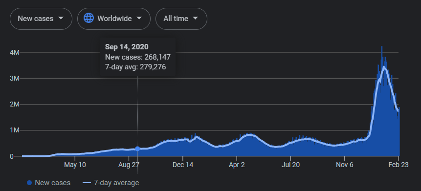
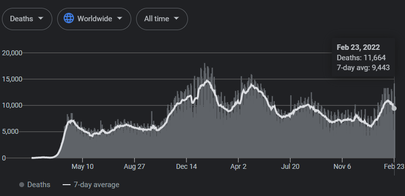

```{r setup, include = FALSE, echo = FALSE}
library(tidyverse)
library(lubridate)
library(gt)
library(paletteer)
library(ggridges)
library(DataExplorer)

#Working directory for .RMD
# knitr::opts_knit$set(echo = TRUE,
#                      root.dir = rprojroot::find_rstudio_root_file())

#Controlling figure output in markdown
knitr::opts_chunk$set(
#  fig.height =   
  fig.width = 6,
#  fig.asp = .5,
  out.width = "90%",
#  out.height = 
 fig.align  = "center",
  cache = FALSE,
  eval  = TRUE,
  echo  = FALSE,
  warning = FALSE,
  include = FALSE
)

#My Colours (from viridis)
my_purple <- "#440154FF"
my_yellow <- "#FDE725FF"

#Set Theme for ggplot2
theme_set(theme_bw() + theme(plot.title = element_text(hjust = 0.5), legend.position = "bottom"))

#Set Scientific notation output and decimal places for knitr
options(scipen = 999)
options(digits = 4)
options(dplyr.summarise.inform = FALSE)
```

```{r data_create, echo = FALSE, eval = FALSE, include = FALSE, warning = FALSE}
#Read in data
covid.df <- read_csv("./original_data/owid-covid-data.csv") %>%
            filter(!is.na(continent)) %>%
            dplyr::select(continent, location, date, population, new_cases,
                          new_cases_smoothed, new_deaths, new_deaths_smoothed,
                          population_density, diabetes_prevalence, gdp_per_capita,
                          median_age, human_development_index) %>%
            mutate(date = as.character(date)) %>%
            filter(!is.na(population))

sum_covid.df <- read_csv("./original_data/owid-covid-data.csv") %>%
                filter(is.na(continent)) %>%
                dplyr::select(-c(iso_code, continent)) %>%
                dplyr::select(location, date, total_cases, total_deaths) %>%
                filter(!(location %in% "International")) %>%
                mutate(
                  location_type = ifelse(str_detect(location, "income"), "Economic Status", "Geographic Region"),
                  date    = lubridate::ymd(date), #to date obj
                  month   = month.name[lubridate::month(date)] %>% #month fct
                            as_factor(),
                  day     = wday(date, 
                                 label = TRUE, #return name i.e "Friday"
                                 abbr  = FALSE, #Return full name
                                 week_start = getOption("lubridate.week.start", 1)), #day of week (auto factor), starts Monday
                ) %>%
                dplyr::select(location, location_type, date, month, day, everything())

#Write out total
write_csv(covid.df, "./original_data/covid19_country_data.csv")
write_csv(sum_covid.df, "./data/covid19_aggregate_data.csv")

#Function to write out and return null
write_null <- function(x, y) {
  write_csv(x, y)
  return(NULL)
}

#Create data folder if it doesn't exist
dir.create("./data/")

#Write out multiple by region
nest.df <- covid.df %>%
  mutate(continent = snakecase::to_any_case(continent, case = "snake")) %>%
  nest(-continent) %>%
  mutate(
    file_path  = sprintf("./data/covid19_%s.csv", continent),
    null       = map2(.x = data, .y = file_path, ~write_null(.x, .y))
 )
```


# Global COVID-19 from 2020 - Present: Directions, Data, and Expectations  

## Repository  

Please initialize a __private__ Github repository entitled `pubh7462_midterm_`*your email handle* AND add me (`@nevilleq`) as a collaborator on Github so I can access the repository for grading. Connect it with an .Rproject as usual and add `/data` to the `gitignore.txt` file.  

## Data  

These COVID-19 Global data were extracted on February 25th, 2022, from [*Our World in Data (OWID)*](https://ourworldindata.org/explorers/coronavirus-data-explorer). These data may be downloaded from OWID's [Github page](https://github.com/owid/covid-19-data/tree/master/public/data), and are actually what Google uses in the data visualizations on their [search page](https://www.google.com/search?q=covid+global+stats). These data are aggregated from multiple sources, but are primarily drawn from Johns Hopkins University's COVID-19 global data base. The full data and variable descriptions are found on OWID's [Github page](https://github.com/owid/covid-19-data/tree/master/public/data), so please do familiarize yourself with the original data and it's source(s).  

The data you will be using has been lightly cleaned, relevant variables extracted, and _seperated_ by continent; and the files can be downloaded fro Canvas [here](https://canvas.umn.edu/courses/293049/assignments/2360517). Please download __all files__ and put them in a `/data` folder (don't forget to add the `/data` to gitignore!).  

## Expectations  

While this assessment is 'comprehensive' in the sense that it utilizes all the skills we've learned thus far in the course, materials that will be most helpful/similar to these questions are found in the Disney Land Reviews activity, Homework 3, and Week 6 Lecture/Activities.  

I promise that you can solve all of these problems with tools and techniques we have covered in class up to this point. However, this assessment concerns real world data and real world questions, which means it will inherently be challenging. Don't worry if you can't get something to work properly -- just do the best you can, document and comment your code so I can give maximum partial credit accordingly.  

**Make sure the repository is private**  

This assessment is "open-world" in the sense that you are allowed to use any resource available to you, online or in a text book. However, the work _must be your own_. This means you must rewrite the code in your own style (like paraphrasing or rewording in a regular paper to avoid plagiarism) __and you may not discuss or share materials with anyone else in class__. I will be personally grading and reviewing all code and I will be able to tell if code has been copy and pasted from another student or source.  

Other than that, this data is quite interesting, current, and relevant to the state of Global Public Health, so please don't forget to have a little fun exploring and learning from these data.  


\newpage


# I. Global COVID-19 from 2020 - Present: Initial (iterative) data read, description, exploration, clean, and tidy **(30pts)**  

Please perform the following tasks -- 

i. Iteratively read in continent specific .csv's
    - and extract relevant meta-data from the file names in the process
ii. Explore the data, check for uniqueness and missingness, and use this to inform your data cleaning/tidying below
    - __Do not omit any `NA`s__
    - You may transform them if you wish (see vi. below), but state clearly in the report how and why you're doing so
iii. Utilize `lubridate` to transform temporal variables accordingly
    - and extract month (i.e January, February, ...) and day of the week (i.e. Monday, Tuesday, ...)
iv. Rename/name variables appropriately
v. Manage/transform data types appropriately (factor vs. character vs. numeric, etc.)
vi. Add _2 new variables_ describing the _cumulative totals_ for cases and deaths _by country_, respectively
    - *Hint* cumulative total by country is a "grouped" "summary" variable, but we want to retain all the original data as well
    - *Hint* `cumsum` will do a lot of the work for you, but you will need to handle `NA`s appropriately first 

After you have completed tasks (*i-vi.*), please describe the 'final' data (number of observations, features, what each describes, how you handled missingness, and anything interesting to note etc.).   

```{r data_read_tidy}
#List files
file_dir  <- "./data/"
file_list <- list.files(file_dir, pattern = c("covid19", ".csv")) #list files
file_list <- file_list[!str_detect(file_list, "aggregate")] #Remove files with "aggregate"

#Read & Tidy
covid.df <- tibble(
              file_list = file_list, #files to be read
              file_path = str_c(file_dir, file_list), #make relative file path
              continent = str_split(file_list, "_", 2) %>% #extract contintent w stringr
                          map_chr(2) %>%
                          str_remove(".csv") %>%
                          str_replace("_", " ") %>%
                          str_to_title()
            ) %>%
            mutate( #Iteratively read in data
              data = map(.x = file_path, ~read_csv(.x, show_col_types = FALSE))
            ) %>%
            dplyr::select(-c(file_list, file_path)) %>% #Remove extra vars
            unnest(data) %>%
            janitor::clean_names() %>%
            mutate( #Clean up time/region
              date    = lubridate::ymd(date), #to date obj
              month   = month.name[lubridate::month(date)] %>% #month fct
                        as_factor(),
              day     = wday(date, 
                             label = TRUE, #return name i.e "Friday"
                             abbr  = FALSE, #Return full name
                             week_start = getOption("lubridate.week.start", 1)), #day of week (auto factor), starts Monday
              country = as_factor(location), #country, region factors
              continent = as_factor(continent),
            ) %>% 
            nest(-country) %>% #group by country
            mutate(
              data = map(.x = data, #for each country
                         ~.x %>%
                           mutate( #compute cumulative totals
                            new_cases_temp  = ifelse(is.na(new_cases), 0, new_cases), #handle NAs
                            new_deaths_temp = ifelse(is.na(new_deaths), 0, new_deaths),
                            cum_cases  = cumsum(new_cases_temp), #get cumulative sums by country
                            cum_deaths = cumsum(new_deaths_temp)                             
                           ) %>%
                           dplyr::select(-contains("temp")) #remove temp variables
                         )
            ) %>%
            unnest(data) %>% #transform back to full data
            dplyr::select(continent, date, day, month,
                          country, contains("cases"), contains("deaths"),
                          everything(), -c(location)
            )

#There are `r nrow(covid.df)` country level observations in these data, with `r ncol(covid.df)` features 
#describing the continent, country, date, new cases, new deaths (and smoothed 7-day rolling estimates of both),
#as well as population, population density, diabetes prevalence, GDP per capita, median age, and human development index score.
```

```{r include = FALSE}
#Data Explorer
introduce(covid.df)
plot_str(covid.df)
plot_missing(covid.df)
plot_histogram(covid.df)
plot_bar(covid.df)
```

\newpage

# II. Global COVID-19 from 2020 - Present: Summary Tables **(35pts)**  

```{r read_aggregate, echo = TRUE}
#Aggregated data (not from same source)
aggregate.df <- read_csv("./data/covid19_aggregate_data.csv", show_col_types = FALSE) %>%
                filter(!(location %in% c("World", "European Union"))) %>%
                mutate(
                  location_type = as.factor(location_type),
                  location      = as.factor(location)
                ) %>%
                group_by(location_type, location) %>%
                summarise(
                  across(
                    .cols  = contains("total"),
                    .fn    = list(max = max),
                    na.rm  = TRUE,
                    .names = "{.col}"
                  )
                ) %>%
                ungroup()
```

```{r aggregate_table, echo = FALSE, include = TRUE}
max_case <- max(aggregate.df$total_cases)
max_death <- max(aggregate.df$total_deaths)

#Aggregate gt()
aggregate.df %>%
  mutate(
    location = fct_reorder2(location, total_deaths, total_cases)
  ) %>%
  rename(
    `Total Cases`    = total_cases,
    `Total Deaths`   = total_deaths,
    `Classification` = location
  ) %>%
  group_by(location_type) %>%
  arrange(`Classification`) %>%
  gt() %>%
  tab_header("COVID-19 Case & Death Aggregate Summary") %>%
  data_color(
    columns = `Total Cases`,
    colors = scales::col_numeric(
      palette = c("white", my_purple),
      domain  = c(0, max_case)
    )
  ) %>%
  data_color(
    columns = `Total Deaths`,
    colors = scales::col_numeric(
      palette = c("white", my_purple),
      domain  = c(0, max_death)
    )
  ) %>%
  fmt_number(
    columns   = where(is.numeric),
    decimals  = 2,
    suffixing = TRUE
  ) %>%
  summary_rows(
    groups  = TRUE,
    columns = contains("Total"),
    fns = list(
        `Global Total` = ~sum(.)
      ),
    formatter = fmt_number,
    decimals  = 2,
    suffixing = TRUE
  ) %>%
  tab_source_note("Data from Jan. 2020 - Feb. 2022, extracted from Our World In Data's Github")
```

Above is a summary table from an aggregated version of the data contained in the same data download (in the `/data` folder). Please use this style and format as a rough template for the tables requested below (similar to those in Lecture Week 6), as well as the global estimates to check yours below.  


## i. Please summarise the _total number of cases and deaths_ __by continent__, and include each continents' _daily average_ and _standard deviation_ of __new cases and deaths__, in a single `gt()`. Comment on the trends you observe. **(25pts)**

Please include the following aesthetics in your `gt()` --  

- Order continents by total cases _and_ deaths (in that order)
- Colour the total cases and deaths column meaningfully
- Add column `tab_spanners` to distinguish case vs. death summaries
- Format numbers appropriately with abbreviations for thousand, million, etc. (`fmt_number`)
- Add a `summary row` at the bottom which describes the "*Global Total*" for cases and deaths  
- Add a `source note` describing the data and its source  

\tiny
*Hint* You can check your Global Totals against Google's current estimate (will be approximately the same, slightly less due to time as your data was pulled on the morning of 2/25).   
\normalsize

```{r continent_summary_df}
continent_sum.df <- covid.df %>%
  nest(-c(country)) %>%
  mutate(
    total_cases  = map_dbl(.x = data, ~.x %>% pull(cum_cases) %>% max()),
    total_deaths = map_dbl(.x = data, ~.x %>% pull(cum_deaths) %>% max()), 
  ) %>%
  unnest() %>%
  group_by(continent) %>%
  summarise(
    `Total Cases`      = sum(unique(total_cases), na.rm = TRUE),
    `Avg. Cases/Day`   = mean(new_cases, na.rm = TRUE),
    `SD Cases/Day`     = sd(new_cases, na.rm = TRUE),
    `Total Deaths`     = sum(unique(total_deaths), na.rm = TRUE),
    `Avg. Deaths/Day`  = mean(new_deaths, na.rm = TRUE),
    `SD Deaths/Day`    = sd(new_deaths, na.rm = TRUE),
  ) %>%
  ungroup() %>%
  mutate(
    Continent = fct_reorder2(continent, `Total Deaths`, `Total Cases`)
  ) %>%
  dplyr::select(Continent, everything(), -continent)
```

```{r continent_summary_viz}
#Dispaly table
continent_sum.df %>%
  arrange(Continent) %>%
  gt() %>%
  tab_header("COVID-19 Case & Death Summary by Continent") %>%
  data_color(
    columns = `Total Cases`,
    colors = scales::col_numeric(
      palette = c("white", my_purple),
      domain  = c(0, max(continent_sum.df$`Total Cases`))
    )
  ) %>%
  data_color(
    columns = `Total Deaths`,
    colors = scales::col_numeric(
      palette = c("white", my_purple),
      domain  = c(0, max(continent_sum.df$`Total Deaths`))
    )
  ) %>%
  tab_spanner(
    label   = "Cases",
    columns = contains("Cases")
  ) %>%
  tab_spanner(
    label   = "Deaths",
    columns = contains("Deaths")
  ) %>%
  fmt_number(
    columns   = where(is.numeric),
    decimals  = 2,
    suffixing = TRUE
  ) %>%
  summary_rows(
    groups  = NULL,
    columns = contains("Total"),
    fns = list(
        `Global Total` = ~sum(.)
      ),
    formatter = fmt_number,
    decimals  = 2,
    suffixing = TRUE
  ) %>%
  tab_source_note("Data from Jan. 2020 - Feb. 2022, extracted from Our World In Data's Github")
```

## ii. Extend the table above to also display the __top 5 countries__ per continent __by total cases__; including all the same summary information, aesthetics, and ordering. **(10pts)**  

_Note:_  The row summary will no longer be a "Global Total" but a "Top 5 Country Total".  


```{r continent_country_df}
continent_sum.df <- covid.df %>%
  nest(-c(country)) %>%
  mutate(
    total_cases  = map_dbl(.x = data, ~.x %>% pull(cum_cases) %>% max()),
    total_deaths = map_dbl(.x = data, ~.x %>% pull(cum_deaths) %>% max()), 
  ) %>%
  unnest() %>%
  group_by(continent, country) %>%
  summarise(
    `Total Cases`      = sum(unique(total_cases), na.rm = TRUE),
    `Avg. Cases/Day`   = mean(new_cases, na.rm = TRUE),
    `SD Cases/Day`     = sd(new_cases, na.rm = TRUE),
    `Total Deaths`     = sum(unique(total_deaths), na.rm = TRUE),
    `Avg. Deaths/Day`  = mean(new_deaths, na.rm = TRUE),
    `SD Deaths/Day`    = sd(new_deaths, na.rm = TRUE),
  ) %>%
  group_by(continent) %>%
  mutate(country   = fct_lump_n(country, n = 5, w = `Total Cases`)) %>%
  ungroup() %>%
  mutate(continent = fct_reorder2(continent, `Total Deaths`, `Total Cases`, .fun = max) %>%
                     str_c(as.numeric(.), ., sep = ". "))  %>%
  filter(!(country %in% "Other"))
```

```{r continent_country_viz}
#Dispaly table
continent_sum.df %>%
  rename(Country = country) %>%
  group_by(continent) %>%
  arrange(desc(`Total Cases`)) %>%
  gt() %>%
  tab_header(
    title    = "COVID19 Case & Death Summary by Continent",
    subtitle = "Top 5 Countries by Total Cases"
    ) %>%
  data_color(
    columns = `Total Cases`,
    colors = scales::col_numeric(
      palette = c("white", my_purple),
      domain  = c(20000, max(continent_sum.df$`Total Cases`))
    )
  ) %>%
  data_color(
    columns = `Total Deaths`,
    colors = scales::col_numeric(
      palette = c("white", my_purple),
      domain  = c(200, max(continent_sum.df$`Total Deaths`))
    )
  ) %>%
  tab_spanner(
    label   = "Cases",
    columns = contains("Cases")
  ) %>%
  tab_spanner(
    label   = "Deaths",
    columns = contains("Deaths")
  ) %>%
  fmt_number(
    columns   = where(is.numeric),
    decimals  = 2,
    suffixing = TRUE
  ) %>%
  summary_rows(
    groups  = NULL,
    columns = contains("Total"),
    fns = list(
        `Global Top 5 Total(s)` = ~sum(.)
      ),
    formatter = fmt_number,
    decimals  = 2,
    suffixing = TRUE
  ) %>%
  tab_source_note("Data from Jan. 2020 - Feb. 25th, 2022, extracted from Our World In Data's Github")
```

\newpage

# III. Global COVID-19 from 2020 - Present: Temporal Trends **(35pts)**  

# i. Globally, on which days of the week are most cases and deaths reported, respectively? **(10pts)**  

You may answer the question with a table, plot, or simply inline `R` to report your answer; your choice.  

```{r}
table.df <-
  covid.df %>%
  group_by(country, day) %>%
  summarise(
    n_deaths = sum(new_deaths, na.rm = TRUE),
    n_cases  = sum(new_cases, na.rm = TRUE)
  ) %>%
  group_by(day) %>%
  summarise(
    `Total Cases`  = sum(n_cases),
    `Total Deaths` = sum(n_deaths),
  ) %>%
  ungroup() %>%
  mutate(
    day = as.factor(day) %>%
          fct_reorder2(`Total Deaths`, `Total Cases`)
  ) %>%
  rename(`Day of the Week` = day) %>%
  arrange(`Day of the Week`)

case_lim <- c(min(table.df$`Total Cases`), max(table.df$`Total Cases`))
death_lim <- c(min(table.df$`Total Deaths`), max(table.df$`Total Deaths`))

table.df %>%
  gt() %>%
  tab_header("COVID-19 Cases & Deaths Reported by Day of the Week") %>%
  data_color(
    columns = `Total Cases`,
    colors = scales::col_numeric(
      palette = c("white", my_purple),
      domain  = case_lim
    )
  ) %>%
  data_color(
    columns = `Total Deaths`,
    colors = scales::col_numeric(
      palette = c("white", my_purple),
      domain  = death_lim
    )
  ) %>%
  fmt_number(
    columns   = where(is.numeric),
    decimals  = 2,
    suffixing = TRUE
  ) %>%
  summary_rows(
    groups  = NULL,
    columns = contains("Total"),
    fns = list(
        `Global Total` = ~sum(.)
      ),
    formatter = fmt_number,
    decimals  = 2,
    suffixing = TRUE
  ) %>%
  tab_source_note("Data from Jan. 2020 - Feb. 25th, 2022, extracted from Our World In Data's Github")
```


## ii. Using `ggplot`, please recreate the global "rolling-average" plots (see below) for new cases _and_ deaths, using _your own theme_, _colours_ **(25pts)**  

The "rolling-average" plots are a combination barplot + lineplot, where the bars are the raw counts and the lines represent the 'smoothed' _7-day rolling average_ (included as a variable in these data, __you do not need to compute this__). An example of each, taken directly from Google, is given below. __Do not__ try to copy the theme or colours of the examples below, please make the the plots your own; and ignore the interactive panel with the date, cases/deaths, and rolling averages as well (we will learn how to make these interactive plots after the break with `ggplotly` though!). Please just include the usual title, informative axes and legends, and proper names/titles. You may facet if you wish but it is not required. 





```{r rolling_avg_df}
#Pivot longer twice by count and average
rolling_avg.df <- covid.df %>%
  group_by(date) %>%
  summarise(
    across(
      .cols = contains(c("new_", "smooth")),
      .fns  = list(sum = sum),
      na.rm = TRUE,
      .names = "{.col}"
    )
  ) %>%
  pivot_longer(
    cols = c("new_cases", "new_deaths"),
    values_to = "count",
    names_to  = "n_type"
  ) %>%
  pivot_longer(
    cols = contains("smoothed"),
    values_to = "avg",
    names_to  = "avg_type"
  ) %>%
  mutate(
    type = case_when(
      (str_detect(n_type, "case") & str_detect(avg_type, "case"))   ~ "Case",
      (str_detect(n_type, "death") & str_detect(avg_type, "death")) ~ "Death",
      TRUE                                                          ~ "Mismatch"
    )
  ) %>%
  filter(!(type %in% "Mismatch")) %>%
  dplyr::select(date, count, avg, type)         
```


```{r rolling_avg_plot}
rolling_avg.df %>%
  ggplot(aes(x = date)) +
  geom_bar(aes(y = count, fill = type), stat = "identity", position = "fill", alpha = 0.1, size = 0.01) +
  geom_smooth(aes(y = avg), colour = "black", span = 0.01) +
  facet_wrap(~type, scales = "free_y") +
  labs(
    x = "Date",
    y = "Number of Observations",
    title = "COVID-19"
  ) +
  scale_colour_viridis_d("Outcome") +
  scale_fill_viridis_d("Outcome") +
  scale_x_date(
    date_breaks = "1 year",
    date_minor_breaks = "1 month",
    date_labels = "%Y%M"
  ) +
  scale_y_continuous(labels = scales::label_number(suffix = " K", scale = 1e-3, accuracy = 1)) +
  theme_minimal() +
  theme(axis.text.x = element_text(angle = 45,
                                   vjust = 1.24,
                                   hjust = 1.2,
                                   size  = 11),
        axis.text.y = element_text(size  = 11))
```
